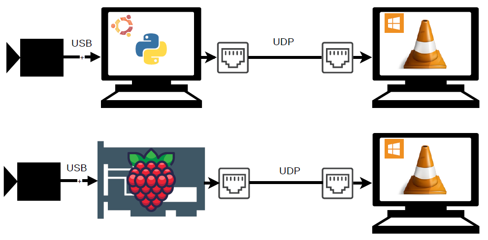
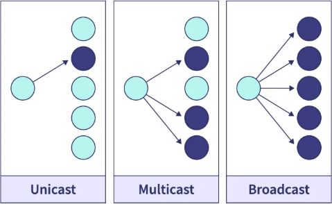
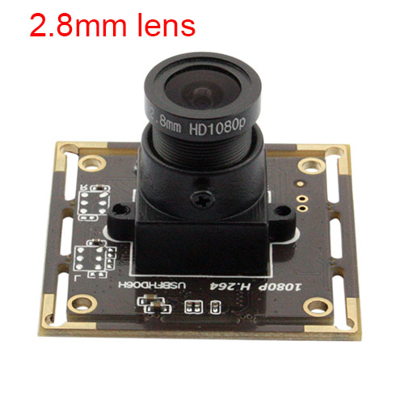
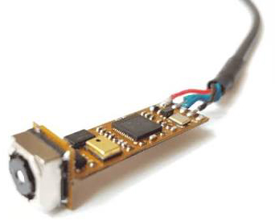
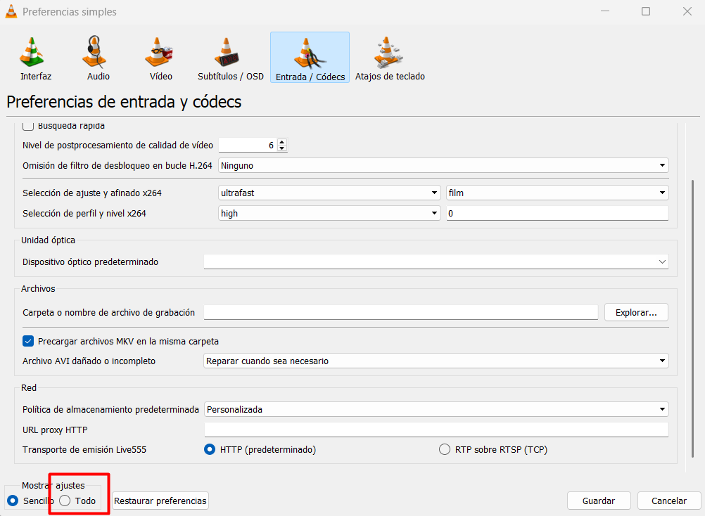
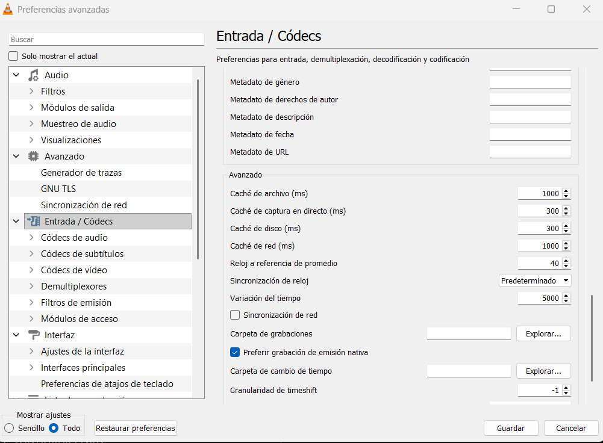
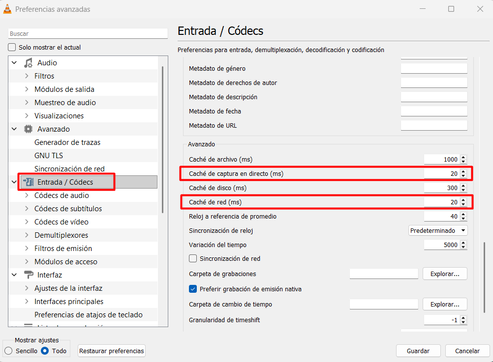

<p align="center"></p>
<h1 align="center">CAM-usb streaming UDP Ethernet </h1> 
<h4 align="right">Jul 26</h4>

<p>
  
  
  
  
</p>

<br>

# Table of contents
- [Table of contents](#table-of-contents)
- [Métodos de Transmisión Datos (state of the art)](#métodos-de-transmisión-datos-state-of-the-art)
- [Camera H264](#camera-h264)
    - [Features:](#features)
- [Camera MJPEG/YUY2](#camera-mjpegyuy2)
    - [Features:](#features-1)
- [cam\_usb\_h264\_streamer.py (Linux)](#cam_usb_h264_streamerpy-linux)
  - [Install](#install)
  - [Use](#use)
- [python cam\_usb\_MJPEG-YUY2\_streamer\_unicast.py (Linux)](#python-cam_usb_mjpeg-yuy2_streamer_unicastpy-linux)
  - [Install](#install-1)
    - [requirements.txt code](#requirementstxt-code)
  - [Use](#use-1)
- [Verificar la recepcion del streaming Unicast/Broadcast (Windows / Linux)](#verificar-la-recepcion-del-streaming-unicastbroadcast-windows--linux)
    - [Con VLC](#con-vlc)
    - [Opcion 1 Achivo \*.sdp](#opcion-1-achivo-sdp)
    - [Opcion 2 (acceso directo VLC)](#opcion-2-acceso-directo-vlc)
    - [Opcion 3](#opcion-3)
    - [Corre el VLC desde terminal (ya configurado la red y el puerto)](#corre-el-vlc-desde-terminal-ya-configurado-la-red-y-el-puerto)
  - [Busca el ejecutable del VLC](#busca-el-ejecutable-del-vlc)
  - [Evitar delay en el streamer del video de VLC](#evitar-delay-en-el-streamer-del-video-de-vlc)
    - [Opcion 4](#opcion-4)
    - [Con QGroundControl](#con-qgroundcontrol)
    - [Con GStreamer, en otro equipo Linux](#con-gstreamer-en-otro-equipo-linux)
  - [Decisiones tecnicas relevantes](#decisiones-tecnicas-relevantes)
  - [Solucion de problemas](#solucion-de-problemas)
- [Codes](#codes)
- [cam\_usb\_h264\_streamer\_unicast\_RPi\_ubunt.py](#cam_usb_h264_streamer_unicast_rpi_ubuntpy)
- [cam\_usb\_h264\_streamer\_broadcast.py](#cam_usb_h264_streamer_broadcastpy)
- [cam\_usb\_MJPEG-YUY2\_streamer\_unicast.py](#cam_usb_mjpeg-yuy2_streamer_unicastpy)
- [Referencias](#referencias)

<br>

Transmision de video por ethernet desde una Camara USB que soporte H264 / MJPEG/YUY2  nativo en 1280x720 @ 30fps. Corriendo en ubuntu 22.04 / Raspberry pi 4.

# Métodos de Transmisión Datos (state of the art)

<p align="center"></p>

```Unicast```: Envía datos desde un emisor hacia un único receptor. Utiliza una dirección MAC/IP de destino específica. ***Es el método más eficiente*** y común para el tráfico diario (como navegar por la web o transferir archivos). 

> :bulb: **Tip:** Es la mejor opcion para usar ```fathom-x tether interface (Modulo L200V20)```

```Broadcast```: Envía datos desde un emisor hacia todos los dispositivos de la red local. Utiliza una dirección MAC especial compuesta solo por letras F (FF:FF:FF:FF:FF:FF). Se usa para tareas de descubrimiento inicial, como el protocolo ARP. 

> :warning: **Warning:** En Broadcast si se usa el ```fathom-x tether interface (Modulo L200V20)``` NO funciona el video, hay perdida de paquetes, y VLC requiere una cantidad minima para poder mostrar un video. 

<br>


# Camera H264
Low light camera

<p align="center"></p>

### Features:
https://www.webcamerausb.com/elp-usb-camera-factory-suppy-2mp-camera-module-with-sony-imx323-cmos-sensor-h264-pc-webcam-1080p-30fps-for-video-conference-low-illumination-usb-camera-1080p-with-28mm-lens-for-windows-linux-android-and-mac-p-97.html

<br>

# Camera MJPEG/YUY2

<p align="center"></p>

Endoscope Camera USB 4k 8MP Sony IMX179 CMOS Auto focus <br>
CMT-8MP-IMX179-W510 (MJPEG/YUY2, sin H264 nativo) <br>
Encoder de hardware (v4l2h264enc) <br>
Encoder de software (x264enc)(aplicacion corriendo actualmente)

### Features:
https://www.dfrobot.com/product-2968.html?srsltid=AfmBOop5MC2mvVKodiFUtkbQmk9DTkFicv0PlGFDEcJJTKUyNcFljkWv

<br>

# cam_usb_h264_streamer.py (Linux)

Aplicacion en Python que detecta automaticamente una camara USB con H264 nativo
(UVC H264) y transmite el video en tiempo real por Ethernet usando RTP/UDP en el
puerto 5600, con el mismo estandar de transmision que usa BlueOS
(mavlink-camera-manager) de Blue Robotics. Compatible con QGroundControl y VLC
sin configuracion manual adicional.

No recodifica video: el H264 que entrega el hardware de la camara se remuxea
directamente a RTP (`h264parse` + `rtph264pay`), por lo que el uso de CPU es bajo.

## Install

```bash
chmod +x install.sh
./install.sh
```

`install.sh` crea el venv (`./venv`) sin `--system-site-packages` e instala
`PyGObject` compilado especificamente para ese interprete, evitando el error
`cannot import name '_gi' from partially initialized module 'gi'` que ocurre
al depender del `python3-gi` del sistema si la version de Python del venv no
coincide exactamente con la del sistema. Si ya existe un venv creado con
`--system-site-packages`, el script lo detecta y lo recrea automaticamente.

Al terminar, active el venv antes de correr la app:

```bash
source venv/bin/activate
```

Si su usuario no pertenece al grupo `video`, agreguelo para poder abrir `/dev/video*`
sin privilegios de superusuario:

```bash
sudo usermod -aG video "$USER"
```
<br>

## Use
Ubuntu / Raspberry Pi4.  <br>

```Unicast:```
```bash
python cam_usb_h264_streamer_unicast_RPi_ubunt.py <ip: cliente> 
# sample:
python cam_usb_h264_streamer_unicast.py 192.168.1.200
```

```Broadcast:```
```bash
python cam_usb_h264_streamer_broadcast.py # sin argumento
```
<br>

# python cam_usb_MJPEG-YUY2_streamer_unicast.py (Linux)
Es lo mismo que la version anterior solo que funciona para camaras MJPEG/YUY2

## Install

```bash
pip install -r requirements.txt
```

### requirements.txt code
```bash
# Dependencias de cam_usb_MJPEG-YUY2_streamer_unicast.py instalables via pip
# (multiplataforma: Linux/RPi y Windows).
#
#   pip install -r requirements.txt

psutil>=5.9

# ---------------------------------------------------------------------------
# GStreamer 1.0 + bindings PyGObject (gi) NO se instalan via pip: requieren
# GStreamer y gobject-introspection instalados a nivel de sistema operativo
# (compilar PyGObject desde pip sin esas librerias de sistema falla). Instalar
# por separado segun la plataforma:
#
# Ubuntu / Raspberry Pi OS (paquetes verificados en Raspberry Pi OS/Debian 13):
#   sudo apt install python3-gi gir1.2-gst-plugins-base-1.0 gstreamer1.0-tools \
#       gstreamer1.0-plugins-base gstreamer1.0-plugins-good \
#       gstreamer1.0-plugins-bad gstreamer1.0-plugins-ugly
#
# Windows:
#   1. Instalar GStreamer (runtime + development, build "MSVC 64-bit") desde
#      https://gstreamer.freedesktop.org/download/, marcando TODOS los
#      conjuntos de plugins (base/good/bad/ugly) durante la instalacion.
#   2. Instalar los bindings PyGObject para Windows (paquete MSYS2
#      mingw-w64-x86_64-python-gobject, o wheels equivalentes) - "pip install
#      PyGObject" por si solo no funciona en Windows sin este paso previo.
# ---------------------------------------------------------------------------
```

## Use
Ubuntu / Raspberry Pi4.  <br>

```Unicast:```
```bash
python cam_usb_MJPEG-YUY2_streamer_unicast.py <ip_cliente_1> [ip_cliente_2 ...]
```


<br>

# Verificar la recepcion del streaming Unicast/Broadcast (Windows / Linux)
> :memo: **Note:** Los 2 PC deben estar en la misma Red

### Con VLC 
### Opcion 1 Achivo *.sdp
Visor de video Unicast/Broadcast

```bash
cam_viewer_Unicast_Broadcast.sdp
```

### Opcion 2 (acceso directo VLC)
Se crea un archivo con el siguiente texto con la siguiente extension ```cam_viewer_Unicast_Broadcast.sdp```
```Bash
v=0
o=- 0 0 IN IP4 0.0.0.0
s=cam_viewer
c=IN IP4 0.0.0.0
t=0 0
a=tool:usb_h264_streamer
a=type:broadcast
a=recvonly
m=video 5600 RTP/AVP 96
a=rtpmap:96 H264/90000
a=framerate:30
a=fmtp:96 packetization-mode=1;sprop-parameter-sets=Z01AH5ZUAoAtyA==,aO44gA==;profile-level-id=4d401f;level-asymmetry-allowed=1
```
- El campo c=IN IP4 <ip> del SDP es solo informativo para el receptor (VLC/QGC) — le dice "escucha aquí". No controla cómo transmite el emisor. Si le pones una dirección multicast real (224.x.x.x–239.x.x.x), algunos reproductores sí intentan unirse a ese grupo multicast automáticamente — pero eso es multicast, no lo mismo que unicast/broadcast.
- El atributo a=type:broadcast que generan tanto tu script como el propio BlueOS (lo vi en el código fuente de mavlink-camera-manager) es solo un campo descriptivo de SDP (RFC 4566, tipo de sesión) — tampoco cambia el modo de entrega real. Es vestigial, no funcional.
- Lo que realmente decide unicast vs. broadcast es el lado del emisor (multiudpsink clients=ip:puerto vs. enviar a 192.168.1.255) — que es justo lo que ya corregimos en cam_usb_h264_streamer_unicast.py. El SDP del receptor no tiene ningún control sobre eso.


### Opcion 3
### Corre el VLC desde terminal (ya configurado la red y el puerto)
```Bash
(echo v=0&echo o=- 0 0 IN IP4 192.168.1.10&echo s=stream&echo c=IN IP4 192.168.2.1&echo t=0 0&echo m=video 5600 RTP/AVP 96&echo a=rtpmap:96 H264/90000) > "%TEMP%\stream.sdp" && "C:\Program Files\VideoLAN\VLC\vlc.exe" --network-caching=0 "%TEMP%\stream.sdp"
```

> :memo: **Note:** VLC graba en /videos si usas Windows para grabar el video

> :memo: **Note:** En caso de error verificar la ruta del VLC

<br>

## Busca el ejecutable del VLC
```Bash
cd "$(dirname "$(find /c/ -name "vlc.exe" -print -quit 2>/dev/null)")"
```

<br>

## Evitar delay en el streamer del video de VLC
<p align="center"></p>
<p align="center"></p>
<p align="center"></p>

<br>

### Opcion 4
### Con QGroundControl

`Application Settings > General > Video` y configurar:

- Video Source: `UDP h.264 Video Stream`
- Port: `5600`

### Con GStreamer, en otro equipo Linux

```bash
gst-launch-1.0 udpsrc port=5600 ! application/x-rtp,payload=96 ! rtph264depay ! avdec_h264 ! videoconvert ! autovideosink
```

## Decisiones tecnicas relevantes

- **Destino UDP = direccion de broadcast del subnet, no la IP unicast propia.**
  El requisito original describe usar la IP del equipo como
  "origen/destino... comportamiento broadcast". Enviar los paquetes a la propia
  IP unicast hace que el kernel los entregue por loopback y nunca salgan por el
  cable, por lo que ningun otro equipo (VLC/QGC remotos) recibiria el stream.
  Para que `udp://@:5600` funcione en cualquier equipo de la LAN sin configurar
  nada, el `udpsink` envia realmente a la **direccion de broadcast** calculada
  como `ip | ~netmask` (modulo estandar `ipaddress`), con la propiedad
  `broadcast=true` del elemento. La IP unicast propia se sigue usando en el
  campo `c=` del SDP informativo, igual que en el descriptor de referencia.
- **Sin recodificacion.** El pipeline es
  `v4l2src -> queue -> capsfilter(video/x-h264) -> h264parse -> rtph264pay -> udpsink`.
  No se usa `x264enc` ni ningun decodificador: el H264 nativo del hardware pasa
  tal cual, solo se reempaqueta en RTP. Esto mantiene el uso de CPU bajo.
- **PyGObject, no `gst-launch-1.0` como subproceso.** El pipeline de streaming se
  construye y controla via `gi.repository.Gst`/`GLib`, con manejo de errores a
  traves del bus de mensajes de GStreamer (`ERROR`, `EOS`), lo que permite
  reconexion programatica limpia. La deteccion de camara si usa `v4l2-ctl` via
  `subprocess` (con timeout), porque es solo una fase de enumeracion/verificacion
  de formatos soportados por hardware, no el pipeline de streaming en si, y
  `v4l2-ctl` (paquete `v4l-utils`) ya es una dependencia de sistema documentada.
- **SPS/PPS y profile-level-id extraidos dinamicamente.** Se agrega un pad probe
  sobre el pad `src` de `rtph264pay` que intercepta el evento `CAPS` una vez que
  GStreamer parseo el SPS/PPS reales del stream de la camara. Con esos valores se
  genera el descriptor SDP de referencia (ver `stream_reference.sdp`, generado en
  el directorio de ejecucion) y se registra en el log. Nada se hardcodea.
- **Logging en texto plano con timestamp, no JSON.** El script se ejecuta
  manualmente en una terminal interactiva; el operador necesita leer los eventos
  en tiempo real, y no hay un agregador de logs en este modo de despliegue.
- **Sin `asyncio`.** `GLib.MainLoop` ya es el bucle de eventos nativo de
  GStreamer y cubre el unico flujo secuencial de esta aplicacion (detectar ->
  transmitir -> reintentar). Anadir `asyncio` encima no aporta beneficio real.

## Solucion de problemas

- **"No se detecto ninguna camara USB compatible"**: verifique con
  `v4l2-ctl --list-devices` y `v4l2-ctl -d /dev/videoX --list-formats-ext` que la
  camara realmente entregue H264 nativo en 1280x720 @ 30fps (algunas camaras UVC
  solo lo soportan en otras resoluciones/framerates).
- **"No se pudo crear el elemento GStreamer..."**: falta un plugin de GStreamer;
  reinstale los paquetes `gstreamer1.0-plugins-*` indicados arriba.
- **No aparece video en VLC/QGC**: confirme que el equipo receptor esta en la
  misma subred que la interfaz Ethernet activa detectada (mismo dominio de
  broadcast), y que ningun firewall bloquea UDP/5600.

<br>

> [!IMPORTANT]
> ```cam_usb_h264_streamer.py``` como ```cam_usb_h264_streamer_RPi.py``` funcionan en UDP Ethernet

- No requiere argumentos ni seleccion manual: detecta la camara y la IP
  automaticamente.
- Detiene la aplicacion de forma limpia con `Ctrl+C` (libera el pipeline de
  GStreamer y el dispositivo de camara).
- Si la camara se desconecta o el pipeline falla, la aplicacion reintenta la
  deteccion y el streaming automaticamente cada pocos segundos, sin reiniciar
  el script.

Ejemplo de log esperado:

```
2026-07-21 10:00:01 [INFO] usb_h264_streamer: Iniciando usb_h264_streamer V1.0
2026-07-21 10:00:01 [INFO] usb_h264_streamer: Camara detectada: /dev/video0
2026-07-21 10:00:01 [INFO] usb_h264_streamer: Interfaz Ethernet activa: eth0 (ip=192.168.2.2, broadcast=192.168.2.255)
2026-07-21 10:00:01 [INFO] usb_h264_streamer: Streaming iniciado: dispositivo=/dev/video0 destino=udp://192.168.2.255:5600 (broadcast, pt=96)
2026-07-21 10:00:01 [INFO] usb_h264_streamer: Descriptor SDP generado dinamicamente desde el stream real: ...
```

<br>

# Codes

***install.sh***
```bash
#!/usr/bin/env bash
# cam_usb_h264_streamer - instalador unico
# @author: Carlos Briceno <carjavi@hotmail.com>
# @version: V1.0
#
# Instala TODO lo necesario para correr cam_usb_h264_streamer.py: paquetes de
# sistema (GStreamer, v4l-utils, headers de compilacion) y PyGObject dentro
# de un venv, compilado especificamente para el interprete de ese venv (evita
# el error "cannot import name '_gi' from partially initialized module 'gi'"
# que ocurre al depender del PyGObject del sistema con --system-site-packages).
#
# Uso:
#   chmod +x install.sh
#   ./install.sh

set -euo pipefail

VENV_DIR="venv"
PYGOBJECT_SPEC="PyGObject>=3.42,<4"

echo "== 1/3: paquetes de sistema =="

# "|| true": en algunas instalaciones de Ubuntu, el hook de post-actualizacion
# de "command-not-found" (cnf-update-db) falla por un problema propio del
# sistema (python3-apt) sin relacion con este proyecto; apt-get update ya
# actualizo la lista de paquetes correctamente antes de llegar a ese hook, asi
# que no debe abortar el resto de la instalacion.
sudo apt-get update || true

# Se instalan en grupos separados a proposito: "apt-get install" es atomico
# -si UN SOLO nombre de paquete no existe en esta version de Ubuntu, no
# instala NINGUNO de la lista, ni siquiera los que si existen. Separando por
# grupo, un nombre de paquete GStreamer que cambie entre versiones de Ubuntu
# no bloquea la instalacion de las herramientas de compilacion que pip
# necesita para PyGObject.

sudo apt-get install -y \
    pkg-config \
    python3-dev \
    python3-venv \
    libcairo2-dev

sudo apt-get install -y \
    gstreamer1.0-tools \
    gstreamer1.0-plugins-base \
    gstreamer1.0-plugins-good \
    gstreamer1.0-plugins-bad \
    gir1.2-gst-plugins-base-1.0 \
    v4l-utils

# El paquete de cabeceras de GObject-Introspection requerido para compilar
# PyGObject via pip cambio de nombre entre versiones de Ubuntu
# (girepository-1.0 -> girepository-2.0, desde Ubuntu 24.04+). Se intenta el
# nombre nuevo primero y se cae al anterior si no existe en esta version.
sudo apt-get install -y libgirepository-2.0-dev \
    || sudo apt-get install -y libgirepository1.0-dev

echo ""
echo "== 2/3: entorno virtual (venv) =="

if [ -f "$VENV_DIR/pyvenv.cfg" ] && grep -q "include-system-site-packages = true" "$VENV_DIR/pyvenv.cfg"; then
    echo "El venv existente en '$VENV_DIR' tiene --system-site-packages activo."
    echo "Con esa bandera, pip ve el PyGObject del sistema como 'ya satisfecho'"
    echo "y no instala la copia compilada para este venv (causa del error _gi)."
    echo "Se recreara sin esa bandera."
    rm -rf "$VENV_DIR"
fi

if [ ! -d "$VENV_DIR" ]; then
    python3 -m venv "$VENV_DIR"
fi

echo ""
echo "== 3/3: PyGObject (compilado especificamente para este venv) =="

"$VENV_DIR/bin/pip" install --upgrade pip
"$VENV_DIR/bin/pip" install "$PYGOBJECT_SPEC"

echo ""
echo "Listo. Para correr la app:"
echo "  source $VENV_DIR/bin/activate"
echo "  python cam_usb_h264_streamer.py"
```

<br>


# cam_usb_h264_streamer_unicast_RPi_ubunt.py 

```Python
#!/usr/bin/env python3
"""
Streaming en tiempo real de una camara USB con H264 nativo hacia la red via RTP/UDP,
compatible con QGroundControl y VLC (mismo estandar que BlueOS / mavlink-camera-manager).

@author: Carlos Briceno <carjavi@hotmail.com>
@date: 21-07-2026
@copyright: Copyright (c) 2026 www.carjavi.com
@version: V1.1
@library:
- Instalacion con un unico script (ver install.sh): instala los paquetes de
  sistema (GStreamer, v4l-utils, headers) y PyGObject dentro del venv,
  compilado especificamente para su interprete.
    ./install.sh

Uso:
    ./cam_usb_h264_streamer_unicast.py <ip_cliente_1> [ip_cliente_2 ...]

Decisiones tecnicas relevantes:
- No se usa asyncio: GLib.MainLoop ya es el bucle de eventos nativo de GStreamer y
  cubre por completo las necesidades de este script (un unico flujo secuencial de
  captura -> pipeline -> reintento). Combinarlo con asyncio anadiria complejidad sin
  beneficio real.
- Logging con formato timestamp/nivel/modulo en texto plano (no JSON): este script se
  ejecuta manualmente en una terminal y debe ser legible en tiempo real por el
  operador; no hay un agregador de logs en este modo de despliegue.
- Destino UDP = UNICAST a los clientes indicados por argumento (via multiudpsink,
  igual que mavlink-camera-manager/BlueOS en src/lib/stream/sink/udp_sink.rs:
  "multiudpsink sync=false clients=ip:puerto,..."), NO la direccion de broadcast del
  subnet. Se cambio de broadcast a unicast tras confirmar con ffprobe (conteo de
  gaps en el numero de secuencia RTP) que, a traves de un enlace HomePlug AV/PLC
  (LX200V20/Fathom), el trafico broadcast no tiene reintento/ACK a nivel de capa MAC
  (igual que en WiFi: solo el trafico unicast se retransmite ante error del medio),
  lo que produce perdida de paquetes real y medible (~9 gaps/seg) que el broadcast
  nunca recupera. Con el mismo enlace y la misma camara, unicast midio 0 gaps en la
  misma ventana de prueba. La IP propia se sigue usando en el campo c= del SDP
  informativo, tal como en el descriptor de referencia.
- La deteccion de camara usa el binario v4l2-ctl (paquete v4l-utils) via subprocess,
  NO gst-launch-1.0: el requisito de evitar subprocess aplica al pipeline de streaming
  (para tener control programatico de errores/reconexion via el bus de GStreamer), no a
  la fase de enumeracion/verificacion de formatos soportados por el hardware, donde
  v4l2-ctl es la herramienta estandar y ya es una dependencia de sistema documentada.
"""

from __future__ import annotations

import glob
import logging
import os
import re
import shutil
import signal
import socket
import struct
import subprocess
import sys
import time
import uuid
from types import FrameType
from typing import Callable

try:
    import fcntl
except ImportError as import_error:
    sys.stderr.write(
        "Error: este script solo puede ejecutarse en Linux (requiere el modulo 'fcntl').\n"
        f"Detalle: {import_error}\n"
    )
    sys.exit(1)

try:
    import gi

    gi.require_version("Gst", "1.0")
    from gi.repository import Gst, GLib
except (ImportError, ValueError) as import_error:
    sys.stderr.write(
        "Error: no se encontraron los bindings de GStreamer (PyGObject/Gst).\n"
        "Instale las dependencias con:\n"
        "  ./install.sh\n"
        f"Detalle: {import_error}\n"
    )
    sys.exit(1)


# ---------------------------------------------------------------------------
# Constantes de configuracion
# ---------------------------------------------------------------------------

APP_NAME = "usb_h264_streamer"
"""Nombre de la aplicacion, usado en logs y en el atributo a=tool del SDP informativo."""

APP_VERSION = "V1.1"
"""Version de la aplicacion, usada en logs y en el atributo a=tool del SDP informativo."""

STREAM_WIDTH = 1280
"""Ancho de video requerido en la camara USB (pixeles)."""

STREAM_HEIGHT = 720
"""Alto de video requerido en la camara USB (pixeles)."""

STREAM_FRAMERATE = 30
"""Framerate requerido en la camara USB (fps)."""

STREAM_UDP_PORT = 5600
"""Puerto UDP de destino, fijo por compatibilidad con QGroundControl/BlueOS."""

RTP_PAYLOAD_TYPE = 96
"""Payload type RTP dinamico usado para H264, segun RFC 3551 (96-127)."""

RECONNECT_DELAY_SECONDS = 4
"""Tiempo de espera entre reintentos de deteccion/streaming tras una falla."""

DEVICE_POLL_INTERVAL_SECONDS = 1
"""Intervalo de verificacion de presencia fisica del dispositivo /dev/videoX durante el streaming."""

PLAYING_TIMEOUT_SECONDS = 8
"""Tiempo maximo de espera a que el pipeline confirme PLAYING antes de abortar y reintentar.

Cubre el caso de una negociacion de caps que se cuelga indefinidamente sin emitir
ningun mensaje de ERROR en el bus (p. ej. un stream-format que la camara no soporta):
sin este watchdog, el mainloop se queda esperando para siempre sin dar ninguna senal."""

V4L2_CTL_TIMEOUT_SECONDS = 5
"""Timeout maximo para cada invocacion del binario v4l2-ctl."""

CAMERA_GLOB_PATTERN = "/dev/video*"
"""Patron glob usado para enumerar los nodos de dispositivo de video V4L2."""

SDP_OUTPUT_PATH = "stream_reference.sdp"
"""Ruta donde se escribe el descriptor SDP informativo, generado dinamicamente desde el stream real."""

SIOCGIFADDR = 0x8915
"""Codigo ioctl de Linux para obtener la direccion IPv4 de una interfaz de red."""

EXCLUDED_INTERFACE_PREFIXES = ("lo", "docker", "veth", "br-", "virbr", "tun", "tap")
"""Prefijos de interfaces virtuales/loopback a excluir al buscar la interfaz Ethernet activa."""

LOG_FILE_PATH = "usb_h264_streamer.log"
"""Archivo donde se registra el detalle tecnico (misma logica que BlueOS/mavlink-camera-manager,
que dejan el detalle en el log del servicio y muestran solo el estado al operador)."""

STATUS_RUNNING = "running!"
"""Texto de estado mostrado en consola mientras el streaming esta activo."""

STATUS_CANCELLED = "cancelado"
"""Texto de estado mostrado en consola al cerrar la aplicacion (Ctrl+C/SIGTERM)."""

logger = logging.getLogger(APP_NAME)


def configure_logging() -> None:
    """Configura el logging raiz con salida a archivo en formato timestamp/nivel/modulo."""
    logging.basicConfig(
        level=logging.INFO,
        format="%(asctime)s [%(levelname)s] %(name)s: %(message)s",
        datefmt="%Y-%m-%d %H:%M:%S",
        filename=LOG_FILE_PATH,
    )


def print_status(status: str) -> None:
    """Imprime en consola la unica linea de estado visible para el operador."""
    print(f"status: {status}", flush=True)


def print_video_target(clients: list[str], port: int) -> None:
    """Imprime la linea de destino del stream, justo antes de la linea de estado."""
    destinos = ", ".join(f"udp://{ip}:{port}" for ip in clients)
    print(f"video to {destinos}", flush=True)


# ---------------------------------------------------------------------------
# Deteccion de camara USB (V4L2)
# ---------------------------------------------------------------------------


class CameraDetector:
    """Detecta automaticamente la primera camara USB que entrega H264 nativo
    en la resolucion y framerate configurados (sin recodificar)."""

    def list_video_devices(self) -> list[str]:
        return sorted(glob.glob(CAMERA_GLOB_PATTERN))

    def _run_v4l2_ctl(self, args: list[str]) -> str | None:
        try:
            result = subprocess.run(
                ["v4l2-ctl", *args],
                capture_output=True,
                text=True,
                timeout=V4L2_CTL_TIMEOUT_SECONDS,
                check=False,
            )
        except (subprocess.TimeoutExpired, OSError) as error:
            logger.debug("Fallo al ejecutar 'v4l2-ctl %s': %s", " ".join(args), error)
            return None
        return result.stdout

    def _get_bus_info(self, device_path: str) -> str | None:
        output = self._run_v4l2_ctl(["-d", device_path, "-D"])
        if not output:
            return None
        match = re.search(r"Bus info\s*:\s*(\S+)", output)
        return match.group(1) if match else None

    def _supports_target_format(self, device_path: str) -> bool:
        output = self._run_v4l2_ctl(["-d", device_path, "--list-formats-ext"])
        if not output:
            return False

        current_format: str | None = None
        current_size: tuple[int, int] | None = None

        for line in output.splitlines():
            format_match = re.match(r"\s*\[\d+\]:\s*'(\w+)'", line)
            if format_match:
                current_format = format_match.group(1)
                continue

            size_match = re.match(r"\s*Size:\s*Discrete\s*(\d+)x(\d+)", line)
            if size_match:
                current_size = (int(size_match.group(1)), int(size_match.group(2)))
                continue

            fps_match = re.search(r"\(([\d.]+)\s*fps\)", line)
            if (
                fps_match
                and current_format == "H264"
                and current_size == (STREAM_WIDTH, STREAM_HEIGHT)
                and abs(float(fps_match.group(1)) - STREAM_FRAMERATE) < 0.5
            ):
                return True

        return False

    def find_h264_camera(self) -> str | None:
        for device_path in self.list_video_devices():
            bus_info = self._get_bus_info(device_path)
            if not bus_info or "usb" not in bus_info.lower():
                logger.debug(
                    "%s descartado: no es un dispositivo USB (bus_info=%s)", device_path, bus_info
                )
                continue
            if not self._supports_target_format(device_path):
                logger.debug(
                    "%s descartado: no soporta H264 %dx%d@%dfps",
                    device_path, STREAM_WIDTH, STREAM_HEIGHT, STREAM_FRAMERATE,
                )
                continue
            logger.debug("%s aceptado: USB + H264 %dx%d@%dfps", device_path, STREAM_WIDTH, STREAM_HEIGHT, STREAM_FRAMERATE)
            return device_path
        return None


# ---------------------------------------------------------------------------
# Deteccion de interfaz Ethernet activa e IP (solo para el campo c= informativo del SDP)
# ---------------------------------------------------------------------------


class NetworkDetector:
    """Detecta la interfaz Ethernet activa del equipo y su IP propia, usada solo
    para el campo informativo c= del SDP de referencia (no para el destino real
    del stream, que ahora es unicast explicito via argumentos de linea de comando)."""

    @staticmethod
    def list_ethernet_interfaces() -> list[str]:
        interfaces: list[str] = []
        net_class_path = "/sys/class/net"
        if not os.path.isdir(net_class_path):
            return interfaces

        for iface in sorted(os.listdir(net_class_path)):
            if iface.startswith(EXCLUDED_INTERFACE_PREFIXES):
                continue
            if os.path.isdir(os.path.join(net_class_path, iface, "wireless")):
                continue

            type_path = os.path.join(net_class_path, iface, "type")
            operstate_path = os.path.join(net_class_path, iface, "operstate")
            try:
                with open(type_path, encoding="utf-8") as type_file:
                    iface_type = type_file.read().strip()
                with open(operstate_path, encoding="utf-8") as operstate_file:
                    operstate = operstate_file.read().strip()
            except OSError:
                continue

            if iface_type == "1" and operstate == "up":
                interfaces.append(iface)

        return interfaces

    @staticmethod
    def get_interface_ipv4(ifname: str) -> str | None:
        with socket.socket(socket.AF_INET, socket.SOCK_DGRAM) as sock:
            try:
                packed_ifname = struct.pack("256s", ifname.encode("utf-8")[:15])
                raw_address = fcntl.ioctl(sock.fileno(), SIOCGIFADDR, packed_ifname)
                return socket.inet_ntoa(raw_address[20:24])
            except OSError:
                return None

    def find_active_ethernet(self) -> tuple[str, str] | None:
        """Busca la primera interfaz Ethernet activa con IPv4 asignada.

        Returns:
            Tupla (interfaz, ip_propia) o None si ninguna interfaz Ethernet
            activa tiene una IPv4 asignada.
        """
        for iface in self.list_ethernet_interfaces():
            ip_address = self.get_interface_ipv4(iface)
            if ip_address:
                return iface, ip_address
        return None


# ---------------------------------------------------------------------------
# Pipeline de GStreamer
# ---------------------------------------------------------------------------


class GstStreamPipeline:
    """Construye y administra el pipeline de GStreamer que remuxea el H264
    nativo de la camara a paquetes RTP/UDP unicast, usando bindings PyGObject
    (sin invocar gst-launch-1.0 como subproceso)."""

    def __init__(
        self,
        device_path: str,
        own_ip: str,
        client_ips: list[str],
        on_playing: Callable[[], None] | None = None,
    ) -> None:
        """Inicializa el manejador de pipeline para un dispositivo y destinos dados.

        Args:
            device_path: Nodo V4L2 de la camara, por ejemplo "/dev/video0".
            own_ip: IP propia del equipo, usada solo para el campo c= del SDP informativo.
            client_ips: Lista de IPs unicast de los clientes a los que se envia el
                stream (equivalente al "clients=ip:puerto,..." de multiudpsink que
                usa mavlink-camera-manager/BlueOS).
            on_playing: Callback invocado una vez cuando el pipeline confirma (via el bus)
                que efectivamente alcanzo el estado PLAYING.
        """
        self.device_path = device_path
        self.own_ip = own_ip
        self.client_ips = client_ips
        self._on_playing = on_playing
        self.pipeline: Gst.Pipeline | None = None
        self._mainloop: GLib.MainLoop | None = None
        self._stop_reason: str | None = None
        self._reached_playing = False
        self._playing_deadline: float | None = None

    def _make_element(self, factory_name: str, element_name: str) -> Gst.Element:
        element = Gst.ElementFactory.make(factory_name, element_name)
        if element is None:
            raise RuntimeError(
                f"No se pudo crear el elemento GStreamer '{factory_name}'. Verifique que los "
                "plugins de GStreamer esten instalados (gstreamer1.0-plugins-base/good/bad)."
            )
        return element

    def build(self) -> None:
        """Construye el pipeline: v4l2src -> queue -> capsfilter(H264) -> h264parse ->
        rtph264pay -> multiudpsink, sin recodificar el video en ningun punto.

        Raises:
            RuntimeError: Si algun elemento de GStreamer requerido no puede crearse.
        """
        self.pipeline = Gst.Pipeline.new("usb_h264_streamer_pipeline")

        source = self._make_element("v4l2src", "camera_source")
        source.set_property("device", self.device_path)
        source.set_property("do-timestamp", True)

        queue = self._make_element("queue", "capture_queue")

        caps_filter = self._make_element("capsfilter", "camera_caps")
        caps_string = (
            f"video/x-h264,width={STREAM_WIDTH},height={STREAM_HEIGHT},"
            f"framerate={STREAM_FRAMERATE}/1"
        )
        caps_filter.set_property("caps", Gst.Caps.from_string(caps_string))

        parser = self._make_element("h264parse", "h264_parser")
        parser.set_property("config-interval", -1)

        payloader = self._make_element("rtph264pay", "rtp_payloader")
        payloader.set_property("pt", RTP_PAYLOAD_TYPE)
        payloader.set_property("config-interval", -1)
        try:
            payloader.set_property("aggregate-mode", "zero-latency")
        except TypeError:
            logger.debug("rtph264pay no soporta 'aggregate-mode' en esta version de GStreamer.")

        # multiudpsink con "clients=ip:puerto,..." en vez de udpsink a la
        # direccion de broadcast: igual que mavlink-camera-manager/BlueOS
        # (src/lib/stream/sink/udp_sink.rs). No requiere SO_BROADCAST porque
        # cada paquete va dirigido a una IP unicast especifica, lo que en un
        # enlace HomePlug AV/PLC (LX200V20) si se beneficia del
        # reintento/ACK a nivel de capa MAC (el broadcast no).
        clients = ",".join(f"{ip}:{STREAM_UDP_PORT}" for ip in self.client_ips)
        sink = self._make_element("multiudpsink", "udp_sink")
        sink.set_property("clients", clients)
        sink.set_property("sync", False)

        for element in (source, queue, caps_filter, parser, payloader, sink):
            self.pipeline.add(element)

        source.link(queue)
        queue.link(caps_filter)
        caps_filter.link(parser)
        parser.link(payloader)
        payloader.link(sink)

        rtp_src_pad = payloader.get_static_pad("src")
        rtp_src_pad.add_probe(Gst.PadProbeType.EVENT_DOWNSTREAM, self._on_rtp_caps_probe)

    def _on_rtp_caps_probe(self, pad: Gst.Pad, probe_info: Gst.PadProbeInfo) -> Gst.PadProbeReturn:
        event = probe_info.get_event()
        if event is None or event.type != Gst.EventType.CAPS:
            return Gst.PadProbeReturn.OK

        caps = event.parse_caps()
        structure = caps.get_structure(0)
        sprop_parameter_sets = structure.get_string("sprop-parameter-sets")
        profile_level_id = structure.get_string("profile-level-id")

        if sprop_parameter_sets and profile_level_id:
            self._log_sdp_reference(sprop_parameter_sets, profile_level_id)
            return Gst.PadProbeReturn.REMOVE

        return Gst.PadProbeReturn.OK

    def _log_sdp_reference(self, sprop_parameter_sets: str, profile_level_id: str) -> None:
        session_id = uuid.uuid4()
        sdp_text = (
            "v=0\n"
            f"s={session_id}\n"
            "i=This is a UDP stream\n"
            "t=0 0\n"
            f"a=tool:{APP_NAME} - {APP_VERSION}\n"
            "a=type:broadcast\n"
            "a=recvonly\n"
            f"m=video {STREAM_UDP_PORT} RTP/AVP {RTP_PAYLOAD_TYPE}\n"
            f"c=IN IP4 {self.own_ip}\n"
            f"a=rtpmap:{RTP_PAYLOAD_TYPE} H264/90000\n"
            f"a=framerate:{STREAM_FRAMERATE}\n"
            f"a=fmtp:{RTP_PAYLOAD_TYPE} packetization-mode=1;"
            f"sprop-parameter-sets={sprop_parameter_sets};"
            f"profile-level-id={profile_level_id};level-asymmetry-allowed=1\n"
        )
        logger.info("Descriptor SDP generado dinamicamente desde el stream real:\n%s", sdp_text)
        try:
            with open(SDP_OUTPUT_PATH, "w", encoding="utf-8") as sdp_file:
                sdp_file.write(sdp_text)
            logger.info("SDP de referencia escrito en %s", SDP_OUTPUT_PATH)
        except OSError as error:
            logger.warning("No se pudo escribir el archivo SDP de referencia: %s", error)

    def _on_bus_message(self, bus: Gst.Bus, message: Gst.Message) -> bool:
        message_type = message.type
        if message_type == Gst.MessageType.ERROR:
            error, debug_info = message.parse_error()
            logger.error("Error de GStreamer: %s (%s)", error.message, debug_info)
            self._stop_reason = "error"
            if self._mainloop:
                self._mainloop.quit()
        elif message_type == Gst.MessageType.EOS:
            logger.warning("Fin de stream (EOS) recibido desde el pipeline.")
            self._stop_reason = "eos"
            if self._mainloop:
                self._mainloop.quit()
        elif message_type == Gst.MessageType.WARNING:
            warning, debug_info = message.parse_warning()
            logger.warning("Advertencia de GStreamer: %s (%s)", warning.message, debug_info)
        elif message_type == Gst.MessageType.STATE_CHANGED and message.src == self.pipeline:
            _, new_state, _ = message.parse_state_changed()
            if new_state == Gst.State.PLAYING:
                self._reached_playing = True
                if self._on_playing is not None:
                    self._on_playing()
                    self._on_playing = None
        return True

    def _check_device_present(self) -> bool:
        if not os.path.exists(self.device_path):
            logger.error("El dispositivo de camara %s ya no esta presente.", self.device_path)
            self._stop_reason = "device_lost"
            if self._mainloop:
                self._mainloop.quit()
            return True

        if (
            not self._reached_playing
            and self._playing_deadline is not None
            and time.monotonic() >= self._playing_deadline
        ):
            logger.error(
                "El pipeline no confirmo PLAYING tras %d s (probable cuelgue de "
                "negociacion de caps). Abortando para reintentar.",
                PLAYING_TIMEOUT_SECONDS,
            )
            self._stop_reason = "playing_timeout"
            if self._mainloop:
                self._mainloop.quit()
        return True

    def run(self) -> str | None:
        assert self.pipeline is not None, "build() debe llamarse antes de run()"

        self._mainloop = GLib.MainLoop()
        bus = self.pipeline.get_bus()
        bus.add_signal_watch()
        bus_handler_id = bus.connect("message", self._on_bus_message)
        device_check_id = GLib.timeout_add_seconds(
            DEVICE_POLL_INTERVAL_SECONDS, self._check_device_present
        )

        self._playing_deadline = time.monotonic() + PLAYING_TIMEOUT_SECONDS
        state_change_return = self.pipeline.set_state(Gst.State.PLAYING)
        if state_change_return == Gst.StateChangeReturn.FAILURE:
            GLib.source_remove(device_check_id)
            bus.disconnect(bus_handler_id)
            bus.remove_signal_watch()
            raise RuntimeError(
                "GStreamer rechazo el cambio de estado a PLAYING (fallo sincronico); "
                "revise las propiedades/caps del pipeline."
            )
        logger.info(
            "Streaming solicitado: dispositivo=%s destino=%s (unicast, pt=%d)",
            self.device_path,
            ", ".join(f"udp://{ip}:{STREAM_UDP_PORT}" for ip in self.client_ips),
            RTP_PAYLOAD_TYPE,
        )

        try:
            self._mainloop.run()
        finally:
            GLib.source_remove(device_check_id)
            bus.disconnect(bus_handler_id)
            bus.remove_signal_watch()

        return self._stop_reason

    def quit(self) -> None:
        self._stop_reason = "shutdown_requested"
        if self._mainloop and self._mainloop.is_running():
            self._mainloop.quit()

    def stop(self) -> None:
        if self.pipeline is not None:
            self.pipeline.set_state(Gst.State.NULL)
            self.pipeline = None


# ---------------------------------------------------------------------------
# Aplicacion principal
# ---------------------------------------------------------------------------


class StreamerApplication:
    """Orquesta el ciclo completo: deteccion de camara, deteccion de red,
    construccion/ejecucion del pipeline y reconexion automatica ante fallas."""

    def __init__(self, client_ips: list[str]) -> None:
        self.client_ips = client_ips
        self._shutdown_requested = False
        self._current_pipeline: GstStreamPipeline | None = None
        signal.signal(signal.SIGINT, self._handle_shutdown_signal)
        signal.signal(signal.SIGTERM, self._handle_shutdown_signal)

    def _handle_shutdown_signal(self, signum: int, frame: FrameType | None) -> None:
        logger.info("Senal de interrupcion recibida (signum=%d), cerrando de forma limpia...", signum)
        self._shutdown_requested = True
        if self._current_pipeline is not None:
            self._current_pipeline.quit()

    def _wait_for_camera(self) -> str | None:
        camera_detector = CameraDetector()
        while not self._shutdown_requested:
            device_path = camera_detector.find_h264_camera()
            if device_path:
                return device_path
            logger.warning(
                "No se detecto ninguna camara USB compatible con H264 %dx%d@%dfps. "
                "Reintentando en %d s...",
                STREAM_WIDTH, STREAM_HEIGHT, STREAM_FRAMERATE, RECONNECT_DELAY_SECONDS,
            )
            time.sleep(RECONNECT_DELAY_SECONDS)
        return None

    def _wait_for_network(self) -> tuple[str, str] | None:
        network_detector = NetworkDetector()
        while not self._shutdown_requested:
            network_info = network_detector.find_active_ethernet()
            if network_info:
                return network_info
            logger.warning(
                "No se detecto ninguna interfaz Ethernet activa con IPv4 asignada. "
                "Reintentando en %d s...", RECONNECT_DELAY_SECONDS,
            )
            time.sleep(RECONNECT_DELAY_SECONDS)
        return None

    def run(self) -> None:
        logger.info("Iniciando %s %s (clientes unicast: %s)", APP_NAME, APP_VERSION, ", ".join(self.client_ips))

        while not self._shutdown_requested:
            device_path = self._wait_for_camera()
            if device_path is None:
                break
            logger.info("Camara detectada: %s", device_path)

            network_info = self._wait_for_network()
            if network_info is None:
                break
            iface, own_ip = network_info
            logger.info("Interfaz Ethernet activa: %s (ip=%s)", iface, own_ip)

            def _on_playing(client_ips: list[str] = self.client_ips) -> None:
                print_video_target(client_ips, STREAM_UDP_PORT)
                print_status(STATUS_RUNNING)

            gst_pipeline = GstStreamPipeline(
                device_path, own_ip, self.client_ips, on_playing=_on_playing
            )
            self._current_pipeline = gst_pipeline
            stop_reason: str | None
            try:
                gst_pipeline.build()
                stop_reason = gst_pipeline.run()
            except Exception as error:  # noqa: BLE001 - se registra y se reintenta, no se propaga
                logger.error("Fallo al construir/ejecutar el pipeline: %s", error)
                stop_reason = "exception"
            finally:
                gst_pipeline.stop()
                self._current_pipeline = None

            if self._shutdown_requested:
                break

            logger.warning(
                "Streaming detenido (motivo=%s). Reintentando en %d s...",
                stop_reason, RECONNECT_DELAY_SECONDS,
            )
            time.sleep(RECONNECT_DELAY_SECONDS)

        logger.info("%s finalizado.", APP_NAME)
        print_status(STATUS_CANCELLED)


def check_required_system_tools() -> None:
    if shutil.which("v4l2-ctl") is None:
        logger.error(
            "No se encontro el binario 'v4l2-ctl'. Instalelo con: sudo apt install v4l-utils"
        )
        sys.stderr.write(
            "Error fatal: no se encontro el binario 'v4l2-ctl'. Instalelo con: "
            "sudo apt install v4l-utils\n"
        )
        sys.exit(1)


def main() -> None:
    """Punto de entrada: configura logging, valida dependencias, inicializa GStreamer y arranca la app."""
    if len(sys.argv) < 2:
        sys.stderr.write(
            "Uso: cam_usb_h264_streamer_unicast.py <ip_cliente_1> [ip_cliente_2 ...]\n"
            "Ejemplo: cam_usb_h264_streamer_unicast.py 192.168.1.200\n"
        )
        sys.exit(1)
    client_ips = sys.argv[1:]

    configure_logging()
    check_required_system_tools()
    Gst.init(None)
    app = StreamerApplication(client_ips)
    app.run()


if __name__ == "__main__":
    main()

```


<br>

# cam_usb_h264_streamer_broadcast.py

```Python

#!/usr/bin/env python3
"""
Streaming en tiempo real de una camara USB con H264 nativo hacia la red via RTP/UDP,
compatible con QGroundControl y VLC (mismo estandar que BlueOS / mavlink-camera-manager).

@author: Carlos Briceno <carjavi@hotmail.com>
@date: 21-07-2026
@copyright: Copyright (c) 2026 www.carjavi.com
@version: V1.0
@library:
- Instalacion con un unico script (ver install.sh): instala los paquetes de
  sistema (GStreamer, v4l-utils, headers) y PyGObject dentro del venv,
  compilado especificamente para su interprete.
    ./install.sh

Decisiones tecnicas relevantes:
- No se usa asyncio: GLib.MainLoop ya es el bucle de eventos nativo de GStreamer y
  cubre por completo las necesidades de este script (un unico flujo secuencial de
  captura -> pipeline -> reintento). Combinarlo con asyncio anadiria complejidad sin
  beneficio real.
- Logging con formato timestamp/nivel/modulo en texto plano (no JSON): este script se
  ejecuta manualmente en una terminal y debe ser legible en tiempo real por el
  operador; no hay un agregador de logs en este modo de despliegue.
- Destino UDP = direccion de broadcast del subnet de la interfaz Ethernet activa
  (IP | ~netmask), NO la IP unicast propia. Enviar paquetes a la propia IP unicast
  los entregaria por loopback y jamas saldrian al cable, incumpliendo el requisito de
  que "cualquier cliente en la misma red" (VLC/QGC en otro equipo) reciba el stream sin
  configuracion adicional. La IP propia se sigue usando en el campo c= del SDP
  informativo, tal como en el descriptor de referencia.
- La deteccion de camara usa el binario v4l2-ctl (paquete v4l-utils) via subprocess,
  NO gst-launch-1.0: el requisito de evitar subprocess aplica al pipeline de streaming
  (para tener control programatico de errores/reconexion via el bus de GStreamer), no a
  la fase de enumeracion/verificacion de formatos soportados por el hardware, donde
  v4l2-ctl es la herramienta estandar y ya es una dependencia de sistema documentada.
"""

from __future__ import annotations

import glob
import ipaddress
import logging
import os
import re
import shutil
import signal
import socket
import struct
import subprocess
import sys
import time
import uuid
from types import FrameType
from typing import Callable

try:
    import fcntl
except ImportError as import_error:
    sys.stderr.write(
        "Error: este script solo puede ejecutarse en Linux (requiere el modulo 'fcntl').\n"
        f"Detalle: {import_error}\n"
    )
    sys.exit(1)

try:
    import gi

    gi.require_version("Gst", "1.0")
    gi.require_version("Gio", "2.0")
    from gi.repository import Gst, GLib, Gio
except (ImportError, ValueError) as import_error:
    sys.stderr.write(
        "Error: no se encontraron los bindings de GStreamer (PyGObject/Gst).\n"
        "Instale las dependencias con:\n"
        "  ./install.sh\n"
        f"Detalle: {import_error}\n"
    )
    sys.exit(1)


# ---------------------------------------------------------------------------
# Constantes de configuracion
# ---------------------------------------------------------------------------

APP_NAME = "usb_h264_streamer"
"""Nombre de la aplicacion, usado en logs y en el atributo a=tool del SDP informativo."""

APP_VERSION = "V1.0"
"""Version de la aplicacion, usada en logs y en el atributo a=tool del SDP informativo."""

STREAM_WIDTH = 1280
"""Ancho de video requerido en la camara USB (pixeles)."""

STREAM_HEIGHT = 720
"""Alto de video requerido en la camara USB (pixeles)."""

STREAM_FRAMERATE = 30
"""Framerate requerido en la camara USB (fps)."""

STREAM_UDP_PORT = 5600
"""Puerto UDP de destino, fijo por compatibilidad con QGroundControl/BlueOS."""

RTP_PAYLOAD_TYPE = 96
"""Payload type RTP dinamico usado para H264, segun RFC 3551 (96-127)."""

RECONNECT_DELAY_SECONDS = 4
"""Tiempo de espera entre reintentos de deteccion/streaming tras una falla."""

DEVICE_POLL_INTERVAL_SECONDS = 1
"""Intervalo de verificacion de presencia fisica del dispositivo /dev/videoX durante el streaming."""

PLAYING_TIMEOUT_SECONDS = 8
"""Tiempo maximo de espera a que el pipeline confirme PLAYING antes de abortar y reintentar.

Cubre el caso de una negociacion de caps que se cuelga indefinidamente sin emitir
ningun mensaje de ERROR en el bus (p. ej. un stream-format que la camara no soporta):
sin este watchdog, el mainloop se queda esperando para siempre sin dar ninguna senal."""

V4L2_CTL_TIMEOUT_SECONDS = 5
"""Timeout maximo para cada invocacion del binario v4l2-ctl."""

CAMERA_GLOB_PATTERN = "/dev/video*"
"""Patron glob usado para enumerar los nodos de dispositivo de video V4L2."""

SDP_OUTPUT_PATH = "stream_reference.sdp"
"""Ruta donde se escribe el descriptor SDP informativo, generado dinamicamente desde el stream real."""

SIOCGIFADDR = 0x8915
"""Codigo ioctl de Linux para obtener la direccion IPv4 de una interfaz de red."""

SIOCGIFNETMASK = 0x891B
"""Codigo ioctl de Linux para obtener la mascara de subred IPv4 de una interfaz de red."""

EXCLUDED_INTERFACE_PREFIXES = ("lo", "docker", "veth", "br-", "virbr", "tun", "tap")
"""Prefijos de interfaces virtuales/loopback a excluir al buscar la interfaz Ethernet activa."""

LOG_FILE_PATH = "usb_h264_streamer.log"
"""Archivo donde se registra el detalle tecnico (misma logica que BlueOS/mavlink-camera-manager,
que dejan el detalle en el log del servicio y muestran solo el estado al operador)."""

STATUS_RUNNING = "running!"
"""Texto de estado mostrado en consola mientras el streaming esta activo."""

STATUS_CANCELLED = "cancelado"
"""Texto de estado mostrado en consola al cerrar la aplicacion (Ctrl+C/SIGTERM)."""

logger = logging.getLogger(APP_NAME)


def configure_logging() -> None:
    """Configura el logging raiz con salida a archivo en formato timestamp/nivel/modulo.

    El detalle tecnico no se muestra en consola: el operador solo ve la linea de
    estado ("status: running!"/"status: cancelado") impresa por print_status(),
    igual que en BlueOS/mavlink-camera-manager. El detalle completo queda en
    LOG_FILE_PATH para diagnostico posterior.
    """
    logging.basicConfig(
        level=logging.INFO,
        format="%(asctime)s [%(levelname)s] %(name)s: %(message)s",
        datefmt="%Y-%m-%d %H:%M:%S",
        filename=LOG_FILE_PATH,
    )


def print_status(status: str) -> None:
    """Imprime en consola la unica linea de estado visible para el operador."""
    print(f"status: {status}", flush=True)


def print_video_target(iface: str, ip_address: str, port: int) -> None:
    """Imprime la linea de destino del stream, justo antes de la linea de estado."""
    print(f"video to {iface} udp://{ip_address}:{port}", flush=True)


# ---------------------------------------------------------------------------
# Deteccion de camara USB (V4L2)
# ---------------------------------------------------------------------------


class CameraDetector:
    """Detecta automaticamente la primera camara USB que entrega H264 nativo
    en la resolucion y framerate configurados (sin recodificar)."""

    def list_video_devices(self) -> list[str]:
        """Enumera los nodos de dispositivo de video disponibles en el sistema.

        Returns:
            Lista ordenada de rutas /dev/videoX encontradas.
        """
        return sorted(glob.glob(CAMERA_GLOB_PATTERN))

    def _run_v4l2_ctl(self, args: list[str]) -> str | None:
        """Ejecuta v4l2-ctl con timeout y devuelve su stdout, o None si falla.

        Args:
            args: Argumentos adicionales para el binario v4l2-ctl.

        Returns:
            La salida estandar del comando, o None si el binario no existe,
            excede el timeout o termina con un error de ejecucion del proceso.
        """
        try:
            result = subprocess.run(
                ["v4l2-ctl", *args],
                capture_output=True,
                text=True,
                timeout=V4L2_CTL_TIMEOUT_SECONDS,
                check=False,
            )
        except (subprocess.TimeoutExpired, OSError) as error:
            logger.debug("Fallo al ejecutar 'v4l2-ctl %s': %s", " ".join(args), error)
            return None
        return result.stdout

    def _get_bus_info(self, device_path: str) -> str | None:
        """Obtiene el campo 'Bus info' de un dispositivo V4L2, usado para confirmar que es USB."""
        output = self._run_v4l2_ctl(["-d", device_path, "-D"])
        if not output:
            return None
        match = re.search(r"Bus info\s*:\s*(\S+)", output)
        return match.group(1) if match else None

    def _supports_target_format(self, device_path: str) -> bool:
        """Verifica si el dispositivo soporta H264 nativo en STREAM_WIDTH x STREAM_HEIGHT @ STREAM_FRAMERATE.

        Parsea la salida de texto de 'v4l2-ctl --list-formats-ext', que agrupa
        formatos de pixel, tamanos discretos e intervalos de captura de forma
        jerarquica e indentada.
        """
        output = self._run_v4l2_ctl(["-d", device_path, "--list-formats-ext"])
        if not output:
            return False

        current_format: str | None = None
        current_size: tuple[int, int] | None = None

        for line in output.splitlines():
            format_match = re.match(r"\s*\[\d+\]:\s*'(\w+)'", line)
            if format_match:
                current_format = format_match.group(1)
                continue

            size_match = re.match(r"\s*Size:\s*Discrete\s*(\d+)x(\d+)", line)
            if size_match:
                current_size = (int(size_match.group(1)), int(size_match.group(2)))
                continue

            fps_match = re.search(r"\(([\d.]+)\s*fps\)", line)
            if (
                fps_match
                and current_format == "H264"
                and current_size == (STREAM_WIDTH, STREAM_HEIGHT)
                and abs(float(fps_match.group(1)) - STREAM_FRAMERATE) < 0.5
            ):
                return True

        return False

    def find_h264_camera(self) -> str | None:
        """Busca la primera camara USB compatible con H264 nativo en la resolucion/framerate configurados.

        Returns:
            La ruta del dispositivo (por ejemplo "/dev/video0") si se encuentra una
            camara compatible, o None si ninguna cumple los requisitos.
        """
        for device_path in self.list_video_devices():
            bus_info = self._get_bus_info(device_path)
            if not bus_info or "usb" not in bus_info.lower():
                logger.debug(
                    "%s descartado: no es un dispositivo USB (bus_info=%s)", device_path, bus_info
                )
                continue
            if not self._supports_target_format(device_path):
                logger.debug(
                    "%s descartado: no soporta H264 %dx%d@%dfps",
                    device_path, STREAM_WIDTH, STREAM_HEIGHT, STREAM_FRAMERATE,
                )
                continue
            logger.debug("%s aceptado: USB + H264 %dx%d@%dfps", device_path, STREAM_WIDTH, STREAM_HEIGHT, STREAM_FRAMERATE)
            return device_path
        return None


# ---------------------------------------------------------------------------
# Deteccion de interfaz Ethernet activa e IP
# ---------------------------------------------------------------------------


class NetworkDetector:
    """Detecta la interfaz Ethernet activa del equipo y calcula su IP y su
    direccion de broadcast, sin requerir configuracion manual."""

    @staticmethod
    def list_ethernet_interfaces() -> list[str]:
        """Enumera interfaces Ethernet fisicas activas (excluye loopback, WiFi y virtuales).

        Returns:
            Lista de nombres de interfaz (por ejemplo ["eth0"]) que son de tipo
            Ethernet (ARPHRD_ETHER), no inalambricas y estan en estado "up".
        """
        interfaces: list[str] = []
        net_class_path = "/sys/class/net"
        if not os.path.isdir(net_class_path):
            return interfaces

        for iface in sorted(os.listdir(net_class_path)):
            if iface.startswith(EXCLUDED_INTERFACE_PREFIXES):
                continue
            if os.path.isdir(os.path.join(net_class_path, iface, "wireless")):
                continue

            type_path = os.path.join(net_class_path, iface, "type")
            operstate_path = os.path.join(net_class_path, iface, "operstate")
            try:
                with open(type_path, encoding="utf-8") as type_file:
                    iface_type = type_file.read().strip()
                with open(operstate_path, encoding="utf-8") as operstate_file:
                    operstate = operstate_file.read().strip()
            except OSError:
                continue

            if iface_type == "1" and operstate == "up":
                interfaces.append(iface)

        return interfaces

    @staticmethod
    def get_interface_ipv4(ifname: str) -> str | None:
        """Obtiene la IPv4 asignada a una interfaz de red usando ioctl SIOCGIFADDR.

        Args:
            ifname: Nombre de la interfaz (por ejemplo "eth0").

        Returns:
            La direccion IPv4 en formato texto, o None si la interfaz no tiene IP asignada.
        """
        with socket.socket(socket.AF_INET, socket.SOCK_DGRAM) as sock:
            try:
                packed_ifname = struct.pack("256s", ifname.encode("utf-8")[:15])
                raw_address = fcntl.ioctl(sock.fileno(), SIOCGIFADDR, packed_ifname)
                return socket.inet_ntoa(raw_address[20:24])
            except OSError:
                return None

    @staticmethod
    def get_interface_netmask(ifname: str) -> str | None:
        """Obtiene la mascara de subred IPv4 de una interfaz usando ioctl SIOCGIFNETMASK.

        Args:
            ifname: Nombre de la interfaz (por ejemplo "eth0").

        Returns:
            La mascara de subred en formato texto, o None si no se pudo determinar.
        """
        with socket.socket(socket.AF_INET, socket.SOCK_DGRAM) as sock:
            try:
                packed_ifname = struct.pack("256s", ifname.encode("utf-8")[:15])
                raw_netmask = fcntl.ioctl(sock.fileno(), SIOCGIFNETMASK, packed_ifname)
                return socket.inet_ntoa(raw_netmask[20:24])
            except OSError:
                return None

    @staticmethod
    def compute_broadcast_address(ip_address: str, netmask: str) -> str:
        """Calcula la direccion de broadcast de una subred IPv4.

        Args:
            ip_address: IP del equipo en esa subred.
            netmask: Mascara de subred asociada.

        Returns:
            La direccion de broadcast (por ejemplo "192.168.2.255" para 192.168.2.10/24).
        """
        network = ipaddress.IPv4Network(f"{ip_address}/{netmask}", strict=False)
        return str(network.broadcast_address)

    def find_active_ethernet(self) -> tuple[str, str, str] | None:
        """Busca la primera interfaz Ethernet activa con IPv4 asignada.

        Returns:
            Tupla (interfaz, ip_propia, ip_broadcast) o None si ninguna interfaz
            Ethernet activa tiene una IPv4 asignada.
        """
        for iface in self.list_ethernet_interfaces():
            ip_address = self.get_interface_ipv4(iface)
            netmask = self.get_interface_netmask(iface)
            if ip_address and netmask:
                broadcast_address = self.compute_broadcast_address(ip_address, netmask)
                return iface, ip_address, broadcast_address
        return None


# ---------------------------------------------------------------------------
# Pipeline de GStreamer
# ---------------------------------------------------------------------------


class GstStreamPipeline:
    """Construye y administra el pipeline de GStreamer que remuxea el H264
    nativo de la camara a paquetes RTP/UDP, usando bindings PyGObject
    (sin invocar gst-launch-1.0 como subproceso)."""

    def __init__(
        self,
        device_path: str,
        own_ip: str,
        broadcast_ip: str,
        on_playing: Callable[[], None] | None = None,
    ) -> None:
        """Inicializa el manejador de pipeline para un dispositivo y destino de red dados.

        Args:
            device_path: Nodo V4L2 de la camara, por ejemplo "/dev/video0".
            own_ip: IP propia del equipo, usada solo para el campo c= del SDP informativo.
            broadcast_ip: IP de broadcast del subnet, usada como destino real del udpsink.
            on_playing: Callback invocado una vez cuando el pipeline confirma (via el bus)
                que efectivamente alcanzo el estado PLAYING.
        """
        self.device_path = device_path
        self.own_ip = own_ip
        self.broadcast_ip = broadcast_ip
        self._on_playing = on_playing
        self.pipeline: Gst.Pipeline | None = None
        self._mainloop: GLib.MainLoop | None = None
        self._stop_reason: str | None = None
        self._reached_playing = False
        self._playing_deadline: float | None = None

    def _make_element(self, factory_name: str, element_name: str) -> Gst.Element:
        """Crea un elemento de GStreamer o lanza un error claro si el plugin no esta instalado."""
        element = Gst.ElementFactory.make(factory_name, element_name)
        if element is None:
            raise RuntimeError(
                f"No se pudo crear el elemento GStreamer '{factory_name}'. Verifique que los "
                "plugins de GStreamer esten instalados (gstreamer1.0-plugins-base/good/bad)."
            )
        return element

    def _configure_broadcast_socket(self, sink: Gst.Element) -> None:
        """Habilita el envio a la IP de broadcast en el udpsink, de forma compatible
        con cualquier version de GStreamer.

        La propiedad "broadcast" de GstUDPSink solo existe desde GStreamer 1.20;
        sin SO_BROADCAST en el socket, el kernel rechaza con EACCES cualquier
        sendto() hacia una IP de broadcast. Por eso se crea el socket UDP a mano
        con SO_BROADCAST y se entrega al elemento via su propiedad "socket"
        (disponible desde GStreamer 1.0), en vez de depender de "broadcast".
        """
        raw_socket = socket.socket(socket.AF_INET, socket.SOCK_DGRAM)
        raw_socket.setsockopt(socket.SOL_SOCKET, socket.SO_BROADCAST, 1)
        gio_socket = Gio.Socket.new_from_fd(raw_socket.detach())
        sink.set_property("socket", gio_socket)
        sink.set_property("close-socket", True)

    def build(self) -> None:
        """Construye el pipeline: v4l2src -> queue -> capsfilter(H264) -> h264parse ->
        rtph264pay -> udpsink, sin recodificar el video en ningun punto.

        El config-interval de h264parse/rtph264pay replica el usado por
        mavlink-camera-manager (BlueOS) para camaras UVC con H264 nativo, que es el
        mismo estandar de referencia que este script sigue para ser compatible con
        QGroundControl/VLC.

        Nota: se evita deliberadamente forzar stream-format=avc despues de h264parse
        (como hace BlueOS) porque esa renegociacion de caps puede quedar esperando
        indefinidamente -sin emitir ningun ERROR en el bus- si la camara no la
        soporta, dejando el pipeline "congelado" en PAUSED. Es una optimizacion de
        CPU, no un requisito funcional, así que no vale el riesgo de un cuelgue
        silencioso.

        Raises:
            RuntimeError: Si algun elemento de GStreamer requerido no puede crearse.
        """
        self.pipeline = Gst.Pipeline.new("usb_h264_streamer_pipeline")

        source = self._make_element("v4l2src", "camera_source")
        source.set_property("device", self.device_path)
        source.set_property("do-timestamp", True)

        # Queue para desacoplar la captura de la escritura en red. Sin "leaky":
        # al ser H264 nativo sin recodificar, descartar un solo frame P rompe la
        # cadena de referencias hasta el proximo keyframe, causando parpadeo/ruido
        # visible que se autocorrige recien en el siguiente GOP. Se usan los
        # limites por defecto de GStreamer (sin perdida, ~1s de margen), suficientes
        # para absorber micro-hiccups sin descartar buffers.
        queue = self._make_element("queue", "capture_queue")

        caps_filter = self._make_element("capsfilter", "camera_caps")
        caps_string = (
            f"video/x-h264,width={STREAM_WIDTH},height={STREAM_HEIGHT},"
            f"framerate={STREAM_FRAMERATE}/1"
        )
        caps_filter.set_property("caps", Gst.Caps.from_string(caps_string))

        # config-interval=-1 reenvia SPS/PPS solo junto a cada keyframe real (IDR),
        # nunca a mitad de GOP. El valor anterior (1 = temporizador fijo de 1s) forzaba
        # la reinsercion de SPS/PPS en un instante arbitrario del GOP, lo que el
        # decodificador interpreta como un cambio de parametros y produce el
        # parpadeo/retroceso periodico reportado.
        parser = self._make_element("h264parse", "h264_parser")
        parser.set_property("config-interval", -1)

        payloader = self._make_element("rtph264pay", "rtp_payloader")
        payloader.set_property("pt", RTP_PAYLOAD_TYPE)
        payloader.set_property("config-interval", -1)
        try:
            # Reduce el retardo de empaquetado (no disponible en versiones viejas
            # de rtph264pay); si falta, se sigue funcionando sin esta optimizacion.
            payloader.set_property("aggregate-mode", "zero-latency")
        except TypeError:
            logger.debug("rtph264pay no soporta 'aggregate-mode' en esta version de GStreamer.")

        sink = self._make_element("udpsink", "udp_sink")
        sink.set_property("host", self.broadcast_ip)
        sink.set_property("port", STREAM_UDP_PORT)
        sink.set_property("sync", False)
        sink.set_property("async", False)
        self._configure_broadcast_socket(sink)

        for element in (source, queue, caps_filter, parser, payloader, sink):
            self.pipeline.add(element)

        source.link(queue)
        queue.link(caps_filter)
        caps_filter.link(parser)
        parser.link(payloader)
        payloader.link(sink)

        rtp_src_pad = payloader.get_static_pad("src")
        rtp_src_pad.add_probe(Gst.PadProbeType.EVENT_DOWNSTREAM, self._on_rtp_caps_probe)

    def _on_rtp_caps_probe(self, pad: Gst.Pad, probe_info: Gst.PadProbeInfo) -> Gst.PadProbeReturn:
        """Intercepta las caps negociadas por rtph264pay para extraer dinamicamente
        sprop-parameter-sets y profile-level-id (SPS/PPS reales del stream), y
        generar con ellos el descriptor SDP de referencia. Se auto-remueve tras el
        primer exito."""
        event = probe_info.get_event()
        if event is None or event.type != Gst.EventType.CAPS:
            return Gst.PadProbeReturn.OK

        caps = event.parse_caps()
        structure = caps.get_structure(0)
        sprop_parameter_sets = structure.get_string("sprop-parameter-sets")
        profile_level_id = structure.get_string("profile-level-id")

        if sprop_parameter_sets and profile_level_id:
            self._log_sdp_reference(sprop_parameter_sets, profile_level_id)
            return Gst.PadProbeReturn.REMOVE

        return Gst.PadProbeReturn.OK

    def _log_sdp_reference(self, sprop_parameter_sets: str, profile_level_id: str) -> None:
        """Genera y registra el descriptor SDP de referencia a partir de datos reales del stream.

        Args:
            sprop_parameter_sets: SPS/PPS codificados en base64, extraidos del stream real.
            profile_level_id: Identificador de perfil/nivel H264, extraido del stream real.
        """
        session_id = uuid.uuid4()
        sdp_text = (
            "v=0\n"
            f"s={session_id}\n"
            "i=This is a UDP stream\n"
            "t=0 0\n"
            f"a=tool:{APP_NAME} - {APP_VERSION}\n"
            "a=type:broadcast\n"
            "a=recvonly\n"
            f"m=video {STREAM_UDP_PORT} RTP/AVP {RTP_PAYLOAD_TYPE}\n"
            f"c=IN IP4 {self.own_ip}\n"
            f"a=rtpmap:{RTP_PAYLOAD_TYPE} H264/90000\n"
            f"a=framerate:{STREAM_FRAMERATE}\n"
            f"a=fmtp:{RTP_PAYLOAD_TYPE} packetization-mode=1;"
            f"sprop-parameter-sets={sprop_parameter_sets};"
            f"profile-level-id={profile_level_id};level-asymmetry-allowed=1\n"
        )
        logger.info("Descriptor SDP generado dinamicamente desde el stream real:\n%s", sdp_text)
        try:
            with open(SDP_OUTPUT_PATH, "w", encoding="utf-8") as sdp_file:
                sdp_file.write(sdp_text)
            logger.info("SDP de referencia escrito en %s", SDP_OUTPUT_PATH)
        except OSError as error:
            logger.warning("No se pudo escribir el archivo SDP de referencia: %s", error)

    def _on_bus_message(self, bus: Gst.Bus, message: Gst.Message) -> bool:
        """Maneja mensajes del bus de GStreamer; ERROR/EOS detienen el mainloop para reconectar."""
        message_type = message.type
        if message_type == Gst.MessageType.ERROR:
            error, debug_info = message.parse_error()
            logger.error("Error de GStreamer: %s (%s)", error.message, debug_info)
            self._stop_reason = "error"
            if self._mainloop:
                self._mainloop.quit()
        elif message_type == Gst.MessageType.EOS:
            logger.warning("Fin de stream (EOS) recibido desde el pipeline.")
            self._stop_reason = "eos"
            if self._mainloop:
                self._mainloop.quit()
        elif message_type == Gst.MessageType.WARNING:
            warning, debug_info = message.parse_warning()
            logger.warning("Advertencia de GStreamer: %s (%s)", warning.message, debug_info)
        elif message_type == Gst.MessageType.STATE_CHANGED and message.src == self.pipeline:
            _, new_state, _ = message.parse_state_changed()
            if new_state == Gst.State.PLAYING:
                self._reached_playing = True
                if self._on_playing is not None:
                    self._on_playing()
                    self._on_playing = None  # notificar una sola vez por corrida
        return True

    def _check_device_present(self) -> bool:
        """Callback periodico (GLib) que detecta la desconexion fisica de la camara y,
        de paso, vigila que el pipeline confirme PLAYING dentro de PLAYING_TIMEOUT_SECONDS.

        Siempre devuelve True (para que GLib lo siga llamando); la remocion de este
        callback se hace de forma explicita y unica en el bloque finally de run(),
        evitando una doble remocion (auto-remocion aqui + remocion en run()) que
        generaria una advertencia espuria de GLib al reintentar remover un source ya
        eliminado.

        Returns:
            Siempre True.
        """
        if not os.path.exists(self.device_path):
            logger.error("El dispositivo de camara %s ya no esta presente.", self.device_path)
            self._stop_reason = "device_lost"
            if self._mainloop:
                self._mainloop.quit()
            return True

        if (
            not self._reached_playing
            and self._playing_deadline is not None
            and time.monotonic() >= self._playing_deadline
        ):
            logger.error(
                "El pipeline no confirmo PLAYING tras %d s (probable cuelgue de "
                "negociacion de caps). Abortando para reintentar.",
                PLAYING_TIMEOUT_SECONDS,
            )
            self._stop_reason = "playing_timeout"
            if self._mainloop:
                self._mainloop.quit()
        return True

    def run(self) -> str | None:
        """Pone el pipeline en PLAYING y bloquea ejecutando el mainloop hasta que
        ocurra un error, EOS, perdida de camara o se solicite apagado externo.

        Returns:
            Motivo de detencion: "error", "eos", "device_lost", "shutdown_requested"
            o None si el mainloop nunca llego a iniciarse.
        """
        assert self.pipeline is not None, "build() debe llamarse antes de run()"

        self._mainloop = GLib.MainLoop()
        bus = self.pipeline.get_bus()
        bus.add_signal_watch()
        bus_handler_id = bus.connect("message", self._on_bus_message)
        device_check_id = GLib.timeout_add_seconds(
            DEVICE_POLL_INTERVAL_SECONDS, self._check_device_present
        )

        self._playing_deadline = time.monotonic() + PLAYING_TIMEOUT_SECONDS
        state_change_return = self.pipeline.set_state(Gst.State.PLAYING)
        if state_change_return == Gst.StateChangeReturn.FAILURE:
            GLib.source_remove(device_check_id)
            bus.disconnect(bus_handler_id)
            bus.remove_signal_watch()
            raise RuntimeError(
                "GStreamer rechazo el cambio de estado a PLAYING (fallo sincronico); "
                "revise las propiedades/caps del pipeline."
            )
        logger.info(
            "Streaming solicitado: dispositivo=%s destino=udp://%s:%d (broadcast, pt=%d)",
            self.device_path, self.broadcast_ip, STREAM_UDP_PORT, RTP_PAYLOAD_TYPE,
        )

        try:
            self._mainloop.run()
        finally:
            GLib.source_remove(device_check_id)
            bus.disconnect(bus_handler_id)
            bus.remove_signal_watch()

        return self._stop_reason

    def quit(self) -> None:
        """Solicita la detencion externa del mainloop (usado por el manejador de SIGINT/SIGTERM)."""
        self._stop_reason = "shutdown_requested"
        if self._mainloop and self._mainloop.is_running():
            self._mainloop.quit()

    def stop(self) -> None:
        """Libera el pipeline de GStreamer de forma segura (estado NULL)."""
        if self.pipeline is not None:
            self.pipeline.set_state(Gst.State.NULL)
            self.pipeline = None


# ---------------------------------------------------------------------------
# Aplicacion principal
# ---------------------------------------------------------------------------


class StreamerApplication:
    """Orquesta el ciclo completo: deteccion de camara, deteccion de red,
    construccion/ejecucion del pipeline y reconexion automatica ante fallas."""

    def __init__(self) -> None:
        """Inicializa la aplicacion y registra los manejadores de senal SIGINT/SIGTERM."""
        self._shutdown_requested = False
        self._current_pipeline: GstStreamPipeline | None = None
        signal.signal(signal.SIGINT, self._handle_shutdown_signal)
        signal.signal(signal.SIGTERM, self._handle_shutdown_signal)

    def _handle_shutdown_signal(self, signum: int, frame: FrameType | None) -> None:
        """Maneja SIGINT/SIGTERM: solicita cierre limpio del pipeline activo y del bucle principal."""
        logger.info("Senal de interrupcion recibida (signum=%d), cerrando de forma limpia...", signum)
        self._shutdown_requested = True
        if self._current_pipeline is not None:
            self._current_pipeline.quit()

    def _wait_for_camera(self) -> str | None:
        """Reintenta la deteccion de camara USB compatible hasta encontrarla o hasta el cierre solicitado."""
        camera_detector = CameraDetector()
        while not self._shutdown_requested:
            device_path = camera_detector.find_h264_camera()
            if device_path:
                return device_path
            logger.warning(
                "No se detecto ninguna camara USB compatible con H264 %dx%d@%dfps. "
                "Reintentando en %d s...",
                STREAM_WIDTH, STREAM_HEIGHT, STREAM_FRAMERATE, RECONNECT_DELAY_SECONDS,
            )
            time.sleep(RECONNECT_DELAY_SECONDS)
        return None

    def _wait_for_network(self) -> tuple[str, str, str] | None:
        """Reintenta la deteccion de interfaz Ethernet activa hasta encontrarla o hasta el cierre solicitado."""
        network_detector = NetworkDetector()
        while not self._shutdown_requested:
            network_info = network_detector.find_active_ethernet()
            if network_info:
                return network_info
            logger.warning(
                "No se detecto ninguna interfaz Ethernet activa con IPv4 asignada. "
                "Reintentando en %d s...", RECONNECT_DELAY_SECONDS,
            )
            time.sleep(RECONNECT_DELAY_SECONDS)
        return None

    def run(self) -> None:
        """Bucle principal: detecta camara y red, transmite, y se reconecta automaticamente ante fallas."""
        logger.info("Iniciando %s %s", APP_NAME, APP_VERSION)

        while not self._shutdown_requested:
            device_path = self._wait_for_camera()
            if device_path is None:
                break
            logger.info("Camara detectada: %s", device_path)

            network_info = self._wait_for_network()
            if network_info is None:
                break
            iface, own_ip, broadcast_ip = network_info
            logger.info(
                "Interfaz Ethernet activa: %s (ip=%s, broadcast=%s)", iface, own_ip, broadcast_ip
            )

            def _on_playing(iface: str = iface, own_ip: str = own_ip) -> None:
                print_video_target(iface, own_ip, STREAM_UDP_PORT)
                print_status(STATUS_RUNNING)

            gst_pipeline = GstStreamPipeline(
                device_path, own_ip, broadcast_ip, on_playing=_on_playing
            )
            self._current_pipeline = gst_pipeline
            stop_reason: str | None
            try:
                gst_pipeline.build()
                stop_reason = gst_pipeline.run()
            except Exception as error:  # noqa: BLE001 - se registra y se reintenta, no se propaga
                logger.error("Fallo al construir/ejecutar el pipeline: %s", error)
                stop_reason = "exception"
            finally:
                gst_pipeline.stop()
                self._current_pipeline = None

            if self._shutdown_requested:
                break

            logger.warning(
                "Streaming detenido (motivo=%s). Reintentando en %d s...",
                stop_reason, RECONNECT_DELAY_SECONDS,
            )
            time.sleep(RECONNECT_DELAY_SECONDS)

        logger.info("%s finalizado.", APP_NAME)
        print_status(STATUS_CANCELLED)


def check_required_system_tools() -> None:
    """Verifica que el binario v4l2-ctl (paquete v4l-utils) este disponible antes de iniciar.

    Termina el proceso con un mensaje claro si falta, en vez de fallar de forma
    confusa durante la deteccion de camara.
    """
    if shutil.which("v4l2-ctl") is None:
        logger.error(
            "No se encontro el binario 'v4l2-ctl'. Instalelo con: sudo apt install v4l-utils"
        )
        sys.stderr.write(
            "Error fatal: no se encontro el binario 'v4l2-ctl'. Instalelo con: "
            "sudo apt install v4l-utils\n"
        )
        sys.exit(1)


def main() -> None:
    """Punto de entrada: configura logging, valida dependencias, inicializa GStreamer y arranca la app."""
    configure_logging()
    check_required_system_tools()
    Gst.init(None)
    app = StreamerApplication()
    app.run()


if __name__ == "__main__":
    main()


```


<br>


# cam_usb_MJPEG-YUY2_streamer_unicast.py

```Python
#!/usr/bin/env python3
"""
Streaming en tiempo real de una camara USB UVC generica SIN H264 nativo (solo
MJPEG/YUYV, como la mayoria de camaras USB de bajo costo) hacia clientes unicast
via RTP/UDP, compatible con QGroundControl y VLC (mismo estandar que BlueOS /
mavlink-camera-manager). Funciona tanto en Linux (RPi/Ubuntu) como en Windows.

@author: Maquintel SpA
@date: 2026-08-04
@version: V1.0

Dependencias:
- GStreamer 1.0 + gst-plugins-base/good/bad/ugly (jpegdec, videoconvert, x264enc)
  y sus bindings de Python (PyGObject / gi).
    Ubuntu/RPi (paquetes verificados en Raspberry Pi OS/Debian 13):
        sudo apt install python3-gi gir1.2-gst-plugins-base-1.0 gstreamer1.0-tools \
            gstreamer1.0-plugins-base gstreamer1.0-plugins-good \
            gstreamer1.0-plugins-bad gstreamer1.0-plugins-ugly
    Windows:
        Instalar el runtime + development de GStreamer (gstreamer.freedesktop.org,
        build "MSVC 64-bit"), marcando TODOS los conjuntos de plugins durante la
        instalacion, y los bindings PyGObject para Windows (paquete MSYS2
        mingw-w64-x86_64-python-gobject, o wheels equivalentes).
- psutil (unica dependencia externa de Python): pip install psutil

Diferencia principal respecto a cam_usb_h264_streamer_unicast_RPi_ubunt.py:
- Ese script asume que la camara entrega H264 nativo y arma un pipeline de solo
  remuxeo (v4l2src -> h264parse -> rtph264pay), sin recodificar.
- La camara USB caracterizada para este script (verificado con
  `ffmpeg -f dshow -list_options -i video="<nombre>"` en Windows, equivalente a
  `v4l2-ctl --list-formats-ext` en Linux) NO entrega H264 en ningun modo: solo
  MJPEG (hasta 1280x720@30fps y superior) y YUYV crudo. Por lo tanto este script
  decodifica MJPEG y recodifica a H264 antes de empaquetar RTP: usa el encoder de
  hardware V4L2 M2M (v4l2h264enc) cuando esta disponible (Raspberry Pi 3/4 con
  bcm2835-codec), y cae a x264enc por software en cualquier otro equipo (Windows,
  RPi5 -que no trae encoder H264 dedicado-, u otros Linux sin V4L2 M2M para H264).
  Esto es distinto del passthrough del script original (que no recodifica nada)
  pero es la unica forma de llegar a H264 con este modelo de camara.

Decisiones tecnicas relevantes:
- Deteccion de camara multiplataforma via Gst.DeviceMonitor (API nativa de
  GStreamer), en vez de v4l2-ctl (solo Linux) o de parsear la salida de
  `ffmpeg -f dshow` (solo Windows, y agregaria una dependencia extra a ffmpeg).
  Ademas, Gst.Device.create_element() crea automaticamente el elemento fuente
  correcto para cada plataforma (v4l2src en Linux, ksvideosrc/mfvideosrc en
  Windows) ya apuntando al dispositivo fisico elegido, sin bifurcar el codigo
  por sistema operativo.
- Deteccion de red via psutil en vez de ioctl/sysfs (solo Linux en el script
  original): unica forma de obtener IP+netmask de forma identica en Linux y
  Windows sin reimplementar la logica dos veces. En este script la IP propia
  detectada es solo informativa (va en el campo c= del SDP de referencia); el
  destino real del stream son las IPs de cliente pasadas por argumento via
  multiudpsink. Por eso no se exige que la interfaz sea especificamente Ethernet
  (a diferencia del script original): alcanza con la primera interfaz activa
  no-loopback/no-virtual con IPv4, sea Ethernet o WiFi. Si no se encuentra
  ninguna, se usa "0.0.0.0" en el SDP y el streaming continua igual (no bloquea).
- La perdida fisica de la camara se detecta re-enumerando periodicamente los
  dispositivos de video (Gst.DeviceMonitor) y verificando que el nombre del
  dispositivo elegido siga apareciendo, en vez de sondear una ruta de archivo
  tipo /dev/videoX (que no existe como concepto en Windows).
- No se usa asyncio: igual que en el script original, GLib.MainLoop cubre por
  completo el bucle de eventos de GStreamer (captura -> pipeline -> reintento).
- Destino UDP = unicast a los clientes indicados por argumento (multiudpsink),
  igual que en cam_usb_h264_streamer_unicast_RPi_ubunt.py.

Uso:
    python cam_usb_MJPEG-YUY2_streamer_unicast.py <ip_cliente_1> [ip_cliente_2 ...]
"""

from __future__ import annotations

import logging
import signal
import socket
import sys
import time
import uuid
from types import FrameType
from typing import Callable

try:
    import psutil
except ImportError as import_error:
    sys.stderr.write(
        "Error: falta la libreria 'psutil'. Instalela con: pip install psutil\n"
        f"Detalle: {import_error}\n"
    )
    sys.exit(1)

try:
    import gi

    gi.require_version("Gst", "1.0")
    from gi.repository import Gst, GLib
except (ImportError, ValueError) as import_error:
    sys.stderr.write(
        "Error: no se encontraron los bindings de GStreamer (PyGObject/Gst).\n"
        "Vea las instrucciones de instalacion en el encabezado de este script.\n"
        f"Detalle: {import_error}\n"
    )
    sys.exit(1)


# ---------------------------------------------------------------------------
# Constantes de configuracion
# ---------------------------------------------------------------------------

APP_NAME = "usb_h264_streamer_multiplatform"
"""Nombre de la aplicacion, usado en logs y en el atributo a=tool del SDP informativo."""

APP_VERSION = "V1.0"
"""Version de la aplicacion, usada en logs y en el atributo a=tool del SDP informativo."""

STREAM_WIDTH = 1280
"""Ancho de video requerido en la camara USB (pixeles)."""

STREAM_HEIGHT = 720
"""Alto de video requerido en la camara USB (pixeles)."""

STREAM_FRAMERATE = 30
"""Framerate requerido en la camara USB (fps)."""

STREAM_UDP_PORT = 5600
"""Puerto UDP de destino, fijo por compatibilidad con QGroundControl/BlueOS."""

RTP_PAYLOAD_TYPE = 96
"""Payload type RTP dinamico usado para H264, segun RFC 3551 (96-127)."""

ENCODER_BITRATE_KBPS = 4000
"""Bitrate objetivo del encoder H264 (kbps), balance calidad/CPU para 720p30."""

ENCODER_KEY_INT_MAX = STREAM_FRAMERATE * 2
"""Intervalo maximo entre keyframes (~2s a 30fps), igual de criterio que config-interval=-1."""

HARDWARE_ENCODER_NAME = "v4l2h264enc"
"""Encoder H264 por hardware (V4L2 M2M) disponible en Raspberry Pi 3/4 (bcm2835-codec).
No existe en Raspberry Pi 5 (sin encoder H264 dedicado) ni en Windows."""

SOFTWARE_ENCODER_NAME = "x264enc"
"""Encoder H264 por software, usado como fallback cuando no hay encoder de hardware
disponible (Windows, RPi5, u otros equipos sin V4L2 M2M para H264)."""

RECONNECT_DELAY_SECONDS = 4
"""Tiempo de espera entre reintentos de deteccion/streaming tras una falla."""

DEVICE_POLL_INTERVAL_SECONDS = 3
"""Intervalo de verificacion de presencia fisica de la camara durante el streaming
(re-enumeracion via Gst.DeviceMonitor; menos frecuente que en el script original
porque cada verificacion abre/cierra un monitor de dispositivos)."""

PLAYING_TIMEOUT_SECONDS = 10
"""Tiempo maximo de espera a que el pipeline confirme PLAYING antes de abortar y reintentar.

Cubre el caso de una negociacion de caps que se cuelga indefinidamente sin emitir
ningun mensaje de ERROR en el bus (p. ej. un modo que la camara no soporta en la
practica pese a anunciarlo): sin este watchdog, el mainloop se queda esperando
para siempre sin dar ninguna senal."""

SDP_OUTPUT_PATH = "stream_reference.sdp"
"""Ruta donde se escribe el descriptor SDP informativo, generado dinamicamente desde el stream real."""

EXCLUDED_INTERFACE_PATTERNS = (
    "lo", "loopback", "docker", "veth", "br-", "virbr", "tun", "tap", "vethernet", "bluetooth",
)
"""Subcadenas (en minuscula) de nombres de interfaz virtuales/loopback a excluir al
buscar la interfaz de red activa, validas tanto para nombres de Linux (lo, docker0,
veth...) como de Windows (vEthernet (Default Switch), Bluetooth Network Connection)."""

LOG_FILE_PATH = "usb_h264_streamer_multiplatform.log"
"""Archivo donde se registra el detalle tecnico (misma logica que BlueOS/mavlink-camera-manager,
que dejan el detalle en el log del servicio y muestran solo el estado al operador)."""

STATUS_RUNNING = "running!"
"""Texto de estado mostrado en consola mientras el streaming esta activo."""

STATUS_CANCELLED = "cancelado"
"""Texto de estado mostrado en consola al cerrar la aplicacion (Ctrl+C/SIGTERM)."""

REQUIRED_GST_ELEMENTS = (
    "queue", "capsfilter", "jpegdec", "videoconvert",
    "h264parse", "rtph264pay", "multiudpsink",
)
"""Elementos de GStreamer usados por el pipeline, independientes de la fuente de video
(la fuente la crea Gst.Device.create_element() con el plugin correcto por plataforma) y
del encoder H264 (hardware o software, verificado aparte por check_h264_encoder_available())."""

logger = logging.getLogger(APP_NAME)


def configure_logging() -> None:
    """Configura el logging raiz con salida a archivo en formato timestamp/nivel/modulo."""
    logging.basicConfig(
        level=logging.INFO,
        format="%(asctime)s [%(levelname)s] %(name)s: %(message)s",
        datefmt="%Y-%m-%d %H:%M:%S",
        filename=LOG_FILE_PATH,
    )


def print_status(status: str) -> None:
    """Imprime en consola la unica linea de estado visible para el operador."""
    print(f"status: {status}", flush=True)


def print_video_target(clients: list[str], port: int) -> None:
    """Imprime la linea de destino del stream, justo antes de la linea de estado."""
    destinos = ", ".join(f"udp://{ip}:{port}" for ip in clients)
    print(f"video to {destinos}", flush=True)


# ---------------------------------------------------------------------------
# Deteccion de camara USB (multiplataforma, via Gst.DeviceMonitor)
# ---------------------------------------------------------------------------


class CameraDetector:
    """Detecta automaticamente la primera camara de video que entrega MJPEG en la
    resolucion y framerate configurados, usando el monitor de dispositivos nativo
    de GStreamer (misma API en Linux y Windows)."""

    @staticmethod
    def _iter_video_source_devices() -> list["Gst.Device"]:
        monitor = Gst.DeviceMonitor.new()
        monitor.add_filter("Video/Source", None)
        if not monitor.start():
            logger.debug("No se pudo iniciar Gst.DeviceMonitor.")
            return []
        try:
            return list(monitor.get_devices())
        finally:
            monitor.stop()

    @staticmethod
    def _structure_matches_target_framerate(structure: "Gst.Structure") -> bool:
        try:
            ok, numerator, denominator = structure.get_fraction("framerate")
            if ok and denominator:
                return abs((numerator / denominator) - STREAM_FRAMERATE) < 0.5
        except (TypeError, ValueError):
            pass

        try:
            framerate_value = structure.get_value("framerate")
        except TypeError:
            return False
        if framerate_value is None:
            return False
        for candidate in framerate_value if isinstance(framerate_value, (list, tuple)) else ():
            numerator = getattr(candidate, "num", None)
            denominator = getattr(candidate, "denom", None)
            if numerator and denominator and abs((numerator / denominator) - STREAM_FRAMERATE) < 0.5:
                return True
        return False

    def _device_supports_target_format(self, device: "Gst.Device") -> bool:
        caps = device.get_caps()
        if caps is None:
            return False

        for index in range(caps.get_size()):
            structure = caps.get_structure(index)
            if structure.get_name() != "image/jpeg":
                continue

            width_ok, width = structure.get_int("width")
            height_ok, height = structure.get_int("height")
            if not (width_ok and height_ok) or (width, height) != (STREAM_WIDTH, STREAM_HEIGHT):
                continue

            if self._structure_matches_target_framerate(structure):
                return True

        return False

    def find_mjpeg_camera(self) -> "Gst.Device | None":
        for device in self._iter_video_source_devices():
            display_name = device.get_display_name()
            if self._device_supports_target_format(device):
                logger.debug(
                    "%s aceptada: MJPEG %dx%d@%dfps",
                    display_name, STREAM_WIDTH, STREAM_HEIGHT, STREAM_FRAMERATE,
                )
                return device
            logger.debug(
                "%s descartada: no soporta MJPEG %dx%d@%dfps",
                display_name, STREAM_WIDTH, STREAM_HEIGHT, STREAM_FRAMERATE,
            )
        return None

    def is_device_still_present(self, display_name: str) -> bool:
        return any(
            device.get_display_name() == display_name for device in self._iter_video_source_devices()
        )


# ---------------------------------------------------------------------------
# Deteccion de interfaz de red activa e IP (solo para el campo c= informativo del SDP)
# ---------------------------------------------------------------------------


class NetworkDetector:
    """Detecta la primera interfaz de red activa con IPv4 asignada, usando psutil
    para obtener el mismo resultado en Linux y Windows sin reimplementar la logica
    de enumeracion dos veces (ioctl/sysfs en un lado, API Win32 en el otro)."""

    @staticmethod
    def _is_excluded_interface(name: str) -> bool:
        lowered = name.lower()
        return any(pattern in lowered for pattern in EXCLUDED_INTERFACE_PATTERNS)

    def find_active_interface(self) -> tuple[str, str] | None:
        """Busca la primera interfaz activa (Ethernet o WiFi) con IPv4 asignada.

        Returns:
            Tupla (interfaz, ip_propia) o None si no se encontro ninguna. El
            resultado es solo informativo (campo c= del SDP): el destino real del
            stream son las IPs de cliente pasadas por argumento.
        """
        try:
            addrs_by_iface = psutil.net_if_addrs()
            stats_by_iface = psutil.net_if_stats()
        except OSError as error:
            logger.debug("No se pudo enumerar interfaces de red via psutil: %s", error)
            return None

        for iface, addrs in addrs_by_iface.items():
            if self._is_excluded_interface(iface):
                continue
            stats = stats_by_iface.get(iface)
            if stats is None or not stats.isup:
                continue
            for addr in addrs:
                if addr.family == socket.AF_INET:
                    return iface, addr.address
        return None


# ---------------------------------------------------------------------------
# Pipeline de GStreamer
# ---------------------------------------------------------------------------


class GstStreamPipeline:
    """Construye y administra el pipeline de GStreamer que decodifica el MJPEG de
    la camara, lo recodifica a H264 por software y lo empaqueta como RTP/UDP
    unicast, usando bindings PyGObject (sin invocar gst-launch-1.0 como subproceso)."""

    def __init__(
        self,
        device: "Gst.Device",
        own_ip: str,
        client_ips: list[str],
        on_playing: Callable[[], None] | None = None,
        prefer_hardware_encoder: bool = True,
    ) -> None:
        """Inicializa el manejador de pipeline para una camara y destinos dados.

        Args:
            device: Dispositivo de video detectado por CameraDetector.
            own_ip: IP propia del equipo, usada solo para el campo c= del SDP informativo.
            client_ips: Lista de IPs unicast de los clientes a los que se envia el
                stream (equivalente al "clients=ip:puerto,..." de multiudpsink que
                usa mavlink-camera-manager/BlueOS).
            on_playing: Callback invocado una vez cuando el pipeline confirma (via el bus)
                que efectivamente alcanzo el estado PLAYING.
            prefer_hardware_encoder: Si es False, se fuerza el uso del encoder de
                software aunque exista uno de hardware disponible. Lo usa
                StreamerApplication para dejar de intentar el encoder de hardware
                despues de una falla en tiempo de ejecucion (ver run()).
        """
        self.device = device
        self.own_ip = own_ip
        self.client_ips = client_ips
        self._on_playing = on_playing
        self.prefer_hardware_encoder = prefer_hardware_encoder
        self.used_hardware_encoder = False
        self.pipeline: Gst.Pipeline | None = None
        self._mainloop: GLib.MainLoop | None = None
        self._stop_reason: str | None = None
        self._reached_playing = False
        self._playing_deadline: float | None = None

    def _make_element(self, factory_name: str, element_name: str) -> Gst.Element:
        element = Gst.ElementFactory.make(factory_name, element_name)
        if element is None:
            raise RuntimeError(
                f"No se pudo crear el elemento GStreamer '{factory_name}'. Verifique que los "
                "plugins de GStreamer esten instalados (gstreamer1.0-plugins-base/good/bad)."
            )
        return element

    def _make_h264_encoder(self) -> tuple[Gst.Element, bool]:
        """Crea el encoder H264, priorizando el encoder de hardware V4L2 M2M
        (v4l2h264enc) cuando esta disponible (Raspberry Pi 3/4 con bcm2835-codec),
        y usando x264enc por software como fallback en cualquier otro equipo
        (Windows, RPi5, PCs Linux sin V4L2 M2M para H264).

        Se prefiere hardware porque libera CPU para el resto de la aplicacion de
        inspeccion (procesamiento de sensores, telemetria, etc.), critico en un
        SoC ARM como el de la RPi.

        Returns:
            Tupla (elemento_encoder, es_hardware). El booleano lo usa build()
            para decidir si debe forzar el formato de entrada a NV12 (requerido
            por el driver bcm2835-codec; sin esto el encoder de hardware falla
            en tiempo de ejecucion con "Failed to process frame" pese a que el
            pipeline negocia caps sin error, porque v4l2h264enc anuncia soporte
            para varios formatos de entrada pero el M2M del SoC solo procesa
            NV12 de forma confiable).
        """
        if self.prefer_hardware_encoder and Gst.ElementFactory.find(HARDWARE_ENCODER_NAME) is not None:
            encoder = self._make_element(HARDWARE_ENCODER_NAME, "h264_encoder")
            # repeat_sequence_header=1 reinserta SPS/PPS en cada IDR (necesario para
            # que un cliente RTP que se une a mitad de stream, como VLC, pueda
            # decodificar sin esperar una reconexion); video_bitrate en bps (V4L2),
            # no en kbps como en x264enc.
            extra_controls = Gst.Structure.new_from_string(
                f"controls,repeat_sequence_header=(int)1,"
                f"video_bitrate=(int){ENCODER_BITRATE_KBPS * 1000}"
            )
            encoder.set_property("extra-controls", extra_controls)
            logger.info("Encoder H264 de hardware detectado: usando %s.", HARDWARE_ENCODER_NAME)
            return encoder, True

        encoder = self._make_element(SOFTWARE_ENCODER_NAME, "h264_encoder")
        encoder.set_property("tune", "zerolatency")
        encoder.set_property("speed-preset", "ultrafast")
        encoder.set_property("bitrate", ENCODER_BITRATE_KBPS)
        encoder.set_property("key-int-max", ENCODER_KEY_INT_MAX)
        logger.info(
            "No se detecto encoder de hardware (%s); usando encoder de software %s.",
            HARDWARE_ENCODER_NAME, SOFTWARE_ENCODER_NAME,
        )
        return encoder, False

    def build(self) -> None:
        """Construye el pipeline: <fuente especifica de plataforma> -> queue ->
        capsfilter(MJPEG) -> jpegdec -> videoconvert -> x264enc -> h264parse ->
        rtph264pay -> multiudpsink.

        A diferencia del script original (passthrough de H264 nativo), aqui la
        camara solo entrega MJPEG, por lo que se decodifica y se recodifica a
        H264 por software antes de empaquetar RTP.

        Raises:
            RuntimeError: Si algun elemento de GStreamer requerido no puede crearse.
        """
        self.pipeline = Gst.Pipeline.new("usb_h264_streamer_pipeline")

        # Gst.Device.create_element() ya devuelve el elemento fuente correcto y
        # configurado para esta plataforma (v4l2src con "device" en Linux,
        # ksvideosrc/mfvideosrc con el indice correspondiente en Windows).
        source = self.device.create_element("camera_source")

        queue = self._make_element("queue", "capture_queue")

        source_caps_filter = self._make_element("capsfilter", "camera_caps")
        source_caps_string = (
            f"image/jpeg,width={STREAM_WIDTH},height={STREAM_HEIGHT},"
            f"framerate={STREAM_FRAMERATE}/1"
        )
        source_caps_filter.set_property("caps", Gst.Caps.from_string(source_caps_string))

        jpeg_decoder = self._make_element("jpegdec", "jpeg_decoder")
        converter = self._make_element("videoconvert", "video_converter")

        encoder, using_hardware_encoder = self._make_h264_encoder()
        self.used_hardware_encoder = using_hardware_encoder

        # El encoder de hardware (v4l2h264enc/bcm2835-codec) solo procesa NV12 de
        # forma confiable pese a anunciar caps mas amplias; ver _make_h264_encoder().
        raw_caps_filter: Gst.Element | None = None
        if using_hardware_encoder:
            raw_caps_filter = self._make_element("capsfilter", "raw_video_caps")
            raw_caps_filter.set_property("caps", Gst.Caps.from_string("video/x-raw,format=NV12"))

        parser = self._make_element("h264parse", "h264_parser")
        parser.set_property("config-interval", -1)

        payloader = self._make_element("rtph264pay", "rtp_payloader")
        payloader.set_property("pt", RTP_PAYLOAD_TYPE)
        payloader.set_property("config-interval", -1)
        try:
            payloader.set_property("aggregate-mode", "zero-latency")
        except TypeError:
            logger.debug("rtph264pay no soporta 'aggregate-mode' en esta version de GStreamer.")

        # multiudpsink con "clients=ip:puerto,..." (unicast explicito a cada
        # cliente), igual que mavlink-camera-manager/BlueOS.
        clients = ",".join(f"{ip}:{STREAM_UDP_PORT}" for ip in self.client_ips)
        sink = self._make_element("multiudpsink", "udp_sink")
        sink.set_property("clients", clients)
        sink.set_property("sync", False)

        elements = [source, queue, source_caps_filter, jpeg_decoder, converter]
        if raw_caps_filter is not None:
            elements.append(raw_caps_filter)
        elements.extend((encoder, parser, payloader, sink))
        for element in elements:
            self.pipeline.add(element)

        source.link(queue)
        queue.link(source_caps_filter)
        source_caps_filter.link(jpeg_decoder)
        jpeg_decoder.link(converter)
        if raw_caps_filter is not None:
            converter.link(raw_caps_filter)
            raw_caps_filter.link(encoder)
        else:
            converter.link(encoder)
        encoder.link(parser)
        parser.link(payloader)
        payloader.link(sink)

        rtp_src_pad = payloader.get_static_pad("src")
        rtp_src_pad.add_probe(Gst.PadProbeType.EVENT_DOWNSTREAM, self._on_rtp_caps_probe)

    def _on_rtp_caps_probe(self, pad: Gst.Pad, probe_info: Gst.PadProbeInfo) -> Gst.PadProbeReturn:
        event = probe_info.get_event()
        if event is None or event.type != Gst.EventType.CAPS:
            return Gst.PadProbeReturn.OK

        caps = event.parse_caps()
        structure = caps.get_structure(0)
        sprop_parameter_sets = structure.get_string("sprop-parameter-sets")
        profile_level_id = structure.get_string("profile-level-id")

        if sprop_parameter_sets and profile_level_id:
            self._log_sdp_reference(sprop_parameter_sets, profile_level_id)
            return Gst.PadProbeReturn.REMOVE

        return Gst.PadProbeReturn.OK

    def _log_sdp_reference(self, sprop_parameter_sets: str, profile_level_id: str) -> None:
        session_id = uuid.uuid4()
        sdp_text = (
            "v=0\n"
            f"s={session_id}\n"
            "i=This is a UDP stream\n"
            "t=0 0\n"
            f"a=tool:{APP_NAME} - {APP_VERSION}\n"
            "a=type:broadcast\n"
            "a=recvonly\n"
            f"m=video {STREAM_UDP_PORT} RTP/AVP {RTP_PAYLOAD_TYPE}\n"
            f"c=IN IP4 {self.own_ip}\n"
            f"a=rtpmap:{RTP_PAYLOAD_TYPE} H264/90000\n"
            f"a=framerate:{STREAM_FRAMERATE}\n"
            f"a=fmtp:{RTP_PAYLOAD_TYPE} packetization-mode=1;"
            f"sprop-parameter-sets={sprop_parameter_sets};"
            f"profile-level-id={profile_level_id};level-asymmetry-allowed=1\n"
        )
        logger.info("Descriptor SDP generado dinamicamente desde el stream real:\n%s", sdp_text)
        try:
            with open(SDP_OUTPUT_PATH, "w", encoding="utf-8") as sdp_file:
                sdp_file.write(sdp_text)
            logger.info("SDP de referencia escrito en %s", SDP_OUTPUT_PATH)
        except OSError as error:
            logger.warning("No se pudo escribir el archivo SDP de referencia: %s", error)

    def _on_bus_message(self, bus: Gst.Bus, message: Gst.Message) -> bool:
        message_type = message.type
        if message_type == Gst.MessageType.ERROR:
            error, debug_info = message.parse_error()
            logger.error("Error de GStreamer: %s (%s)", error.message, debug_info)
            self._stop_reason = "error"
            if self._mainloop:
                self._mainloop.quit()
        elif message_type == Gst.MessageType.EOS:
            logger.warning("Fin de stream (EOS) recibido desde el pipeline.")
            self._stop_reason = "eos"
            if self._mainloop:
                self._mainloop.quit()
        elif message_type == Gst.MessageType.WARNING:
            warning, debug_info = message.parse_warning()
            logger.warning("Advertencia de GStreamer: %s (%s)", warning.message, debug_info)
        elif message_type == Gst.MessageType.STATE_CHANGED and message.src == self.pipeline:
            _, new_state, _ = message.parse_state_changed()
            if new_state == Gst.State.PLAYING:
                self._reached_playing = True
                if self._on_playing is not None:
                    self._on_playing()
                    self._on_playing = None
        return True

    def _check_camera_and_timeout(self) -> bool:
        if not CameraDetector().is_device_still_present(self.device.get_display_name()):
            logger.error("La camara '%s' ya no esta presente.", self.device.get_display_name())
            self._stop_reason = "device_lost"
            if self._mainloop:
                self._mainloop.quit()
            return True

        if (
            not self._reached_playing
            and self._playing_deadline is not None
            and time.monotonic() >= self._playing_deadline
        ):
            logger.error(
                "El pipeline no confirmo PLAYING tras %d s (probable cuelgue de "
                "negociacion de caps). Abortando para reintentar.",
                PLAYING_TIMEOUT_SECONDS,
            )
            self._stop_reason = "playing_timeout"
            if self._mainloop:
                self._mainloop.quit()
        return True

    def run(self) -> str | None:
        assert self.pipeline is not None, "build() debe llamarse antes de run()"

        self._mainloop = GLib.MainLoop()
        bus = self.pipeline.get_bus()
        bus.add_signal_watch()
        bus_handler_id = bus.connect("message", self._on_bus_message)
        device_check_id = GLib.timeout_add_seconds(
            DEVICE_POLL_INTERVAL_SECONDS, self._check_camera_and_timeout
        )

        self._playing_deadline = time.monotonic() + PLAYING_TIMEOUT_SECONDS
        state_change_return = self.pipeline.set_state(Gst.State.PLAYING)
        if state_change_return == Gst.StateChangeReturn.FAILURE:
            GLib.source_remove(device_check_id)
            bus.disconnect(bus_handler_id)
            bus.remove_signal_watch()
            raise RuntimeError(
                "GStreamer rechazo el cambio de estado a PLAYING (fallo sincronico); "
                "revise las propiedades/caps del pipeline."
            )
        logger.info(
            "Streaming solicitado: camara=%s destino=%s (unicast, pt=%d)",
            self.device.get_display_name(),
            ", ".join(f"udp://{ip}:{STREAM_UDP_PORT}" for ip in self.client_ips),
            RTP_PAYLOAD_TYPE,
        )

        try:
            self._mainloop.run()
        finally:
            GLib.source_remove(device_check_id)
            bus.disconnect(bus_handler_id)
            bus.remove_signal_watch()

        return self._stop_reason

    def quit(self) -> None:
        self._stop_reason = "shutdown_requested"
        if self._mainloop and self._mainloop.is_running():
            self._mainloop.quit()

    def stop(self) -> None:
        if self.pipeline is not None:
            self.pipeline.set_state(Gst.State.NULL)
            self.pipeline = None


# ---------------------------------------------------------------------------
# Aplicacion principal
# ---------------------------------------------------------------------------


class StreamerApplication:
    """Orquesta el ciclo completo: deteccion de camara, deteccion de red,
    construccion/ejecucion del pipeline y reconexion automatica ante fallas."""

    def __init__(self, client_ips: list[str]) -> None:
        self.client_ips = client_ips
        self._shutdown_requested = False
        self._current_pipeline: GstStreamPipeline | None = None
        self._prefer_hardware_encoder = True
        signal.signal(signal.SIGINT, self._handle_shutdown_signal)
        signal.signal(signal.SIGTERM, self._handle_shutdown_signal)

    def _handle_shutdown_signal(self, signum: int, frame: FrameType | None) -> None:
        logger.info("Senal de interrupcion recibida (signum=%d), cerrando de forma limpia...", signum)
        self._shutdown_requested = True
        if self._current_pipeline is not None:
            self._current_pipeline.quit()

    def _wait_for_camera(self) -> "Gst.Device | None":
        camera_detector = CameraDetector()
        while not self._shutdown_requested:
            device = camera_detector.find_mjpeg_camera()
            if device:
                return device
            logger.warning(
                "No se detecto ninguna camara compatible con MJPEG %dx%d@%dfps. "
                "Reintentando en %d s...",
                STREAM_WIDTH, STREAM_HEIGHT, STREAM_FRAMERATE, RECONNECT_DELAY_SECONDS,
            )
            time.sleep(RECONNECT_DELAY_SECONDS)
        return None

    def _detect_own_ip(self) -> str:
        """Detecta la IP propia solo con fines informativos (campo c= del SDP).

        A diferencia de la deteccion de camara, esto no bloquea el streaming: si
        no se encuentra ninguna interfaz activa se usa "0.0.0.0" y se continua,
        porque el destino real del stream ya viene fijado por los argumentos de
        linea de comando.
        """
        network_info = NetworkDetector().find_active_interface()
        if network_info is None:
            logger.warning(
                "No se detecto ninguna interfaz de red activa con IPv4; "
                "se usara 0.0.0.0 en el SDP informativo."
            )
            return "0.0.0.0"
        iface, ip_address = network_info
        logger.info("Interfaz de red activa detectada: %s (ip=%s)", iface, ip_address)
        return ip_address

    def run(self) -> None:
        logger.info(
            "Iniciando %s %s (clientes unicast: %s)", APP_NAME, APP_VERSION, ", ".join(self.client_ips)
        )

        while not self._shutdown_requested:
            device = self._wait_for_camera()
            if device is None:
                break
            logger.info("Camara detectada: %s", device.get_display_name())

            own_ip = self._detect_own_ip()

            def _on_playing(client_ips: list[str] = self.client_ips) -> None:
                print_video_target(client_ips, STREAM_UDP_PORT)
                print_status(STATUS_RUNNING)

            gst_pipeline = GstStreamPipeline(
                device, own_ip, self.client_ips, on_playing=_on_playing,
                prefer_hardware_encoder=self._prefer_hardware_encoder,
            )
            self._current_pipeline = gst_pipeline
            stop_reason: str | None
            try:
                gst_pipeline.build()
                stop_reason = gst_pipeline.run()
            except Exception as error:  # noqa: BLE001 - se registra y se reintenta, no se propaga
                logger.error("Fallo al construir/ejecutar el pipeline: %s", error)
                stop_reason = "exception"
            finally:
                used_hardware_encoder = gst_pipeline.used_hardware_encoder
                gst_pipeline.stop()
                self._current_pipeline = None

            if self._shutdown_requested:
                break

            if stop_reason == "error" and used_hardware_encoder and self._prefer_hardware_encoder:
                logger.warning(
                    "El encoder de hardware %s fallo en tiempo de ejecucion "
                    "('Failed to process frame'). Esto suele deberse a memoria "
                    "CMA/GPU insuficiente reservada para bcm2835-codec en "
                    "/boot/firmware/config.txt (revisar 'dtoverlay=vc4-kms-v3d,cma-<N>' "
                    "o 'gpu_mem'). Se usara el encoder de software %s en los "
                    "proximos intentos de esta ejecucion.",
                    HARDWARE_ENCODER_NAME, SOFTWARE_ENCODER_NAME,
                )
                self._prefer_hardware_encoder = False

            logger.warning(
                "Streaming detenido (motivo=%s). Reintentando en %d s...",
                stop_reason, RECONNECT_DELAY_SECONDS,
            )
            time.sleep(RECONNECT_DELAY_SECONDS)

        logger.info("%s finalizado.", APP_NAME)
        print_status(STATUS_CANCELLED)


def check_required_gst_elements() -> None:
    """Verifica que los plugins de GStreamer requeridos por el pipeline esten
    disponibles (independiente de la fuente de video, que se resuelve por
    plataforma via Gst.Device.create_element()).

    Termina el proceso con instrucciones claras de instalacion si falta alguno,
    en vez de fallar de forma confusa durante la construccion del pipeline.
    """
    missing = [name for name in REQUIRED_GST_ELEMENTS if Gst.ElementFactory.find(name) is None]
    if missing:
        message = (
            "Faltan plugins de GStreamer requeridos: " + ", ".join(missing) + "\n"
            "Ubuntu/RPi: sudo apt install gstreamer1.0-plugins-base gstreamer1.0-plugins-good "
            "gstreamer1.0-plugins-bad gstreamer1.0-plugins-ugly\n"
            "Windows: reinstale GStreamer marcando TODOS los conjuntos de plugins "
            "(base/good/bad/ugly) en el instalador de gstreamer.freedesktop.org.\n"
        )
        logger.error(message)
        sys.stderr.write(f"Error fatal: {message}")
        sys.exit(1)


def check_h264_encoder_available() -> None:
    """Verifica que exista al menos un encoder H264 (hardware o software).

    Termina el proceso con instrucciones claras si no se encuentra ninguno, en
    vez de fallar de forma confusa durante la construccion del pipeline.
    """
    if Gst.ElementFactory.find(HARDWARE_ENCODER_NAME) is not None:
        return
    if Gst.ElementFactory.find(SOFTWARE_ENCODER_NAME) is not None:
        return
    message = (
        f"No se encontro ningun encoder H264 ({HARDWARE_ENCODER_NAME} ni "
        f"{SOFTWARE_ENCODER_NAME}).\n"
        "Ubuntu/RPi: sudo apt install gstreamer1.0-plugins-ugly gstreamer1.0-plugins-good\n"
        "Windows: reinstale GStreamer marcando el conjunto de plugins 'ugly'.\n"
    )
    logger.error(message)
    sys.stderr.write(f"Error fatal: {message}")
    sys.exit(1)


def main() -> None:
    """Punto de entrada: configura logging, inicializa GStreamer, valida
    dependencias y arranca la aplicacion."""
    if len(sys.argv) < 2:
        sys.stderr.write(
            "Uso: cam_usb_MJPEG-YUY2_streamer_unicast.py <ip_cliente_1> [ip_cliente_2 ...]\n"
            "Ejemplo: cam_usb_MJPEG-YUY2_streamer_unicast.py 192.168.1.200\n"
        )
        sys.exit(1)
    client_ips = sys.argv[1:]

    configure_logging()
    Gst.init(None)
    check_required_gst_elements()
    check_h264_encoder_available()
    app = StreamerApplication(client_ips)
    app.run()


if __name__ == "__main__":
    main()


```

<br>


# Referencias

- https://github.com/bluerobotics/mavlink-camera-manager
- https://gstreamer.freedesktop.org/documentation/
- https://gitlab.freedesktop.org/gstreamer/gst-plugins-good (v4l2src, rtph264pay, udpsink)
- https://www.kernel.org/doc/html/latest/userspace-api/media/v4l/v4l2.html
- https://docs.qgroundcontrol.com/master/en/qgc-user-guide/settings_view/general.html
- https://pygobject.gnome.org/

<br>

---

<div>
  <p>
     Copyright &nbsp;&copy; 2023 Instinto Digital <a href="https://carjavi.github.io/" title="carjavi.github">carjavi</a>
  </p>
</div>

<p align="center">
    <a href="https://instintodigital.net/" target="_blank"></a>
</p>


